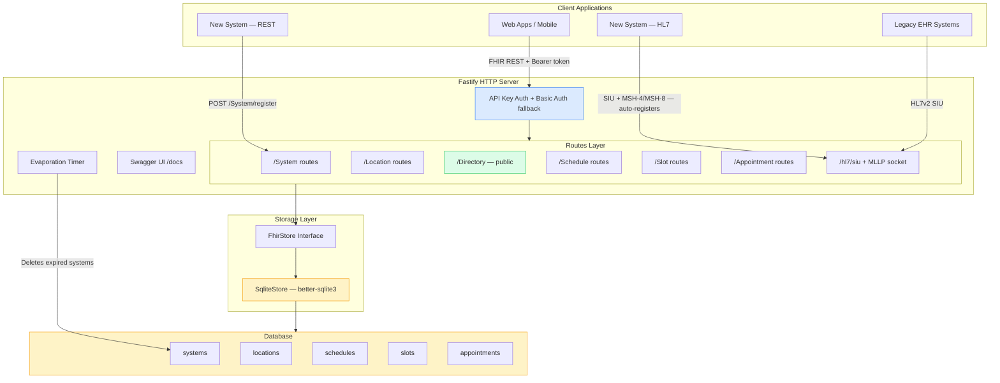
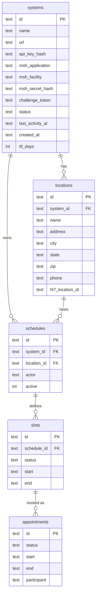
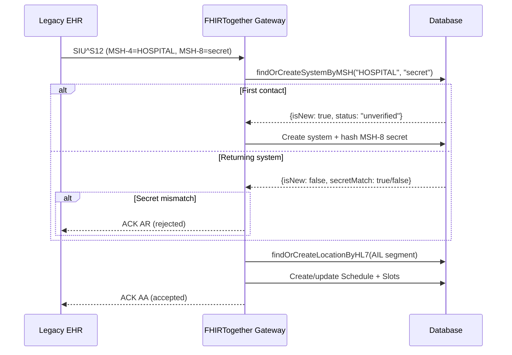
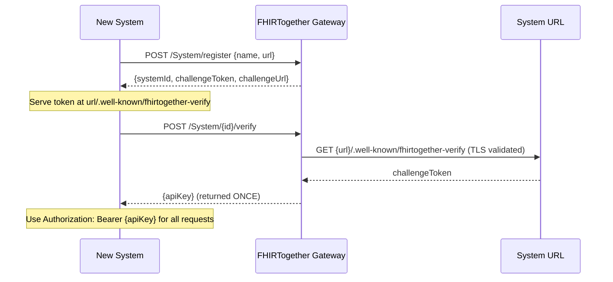
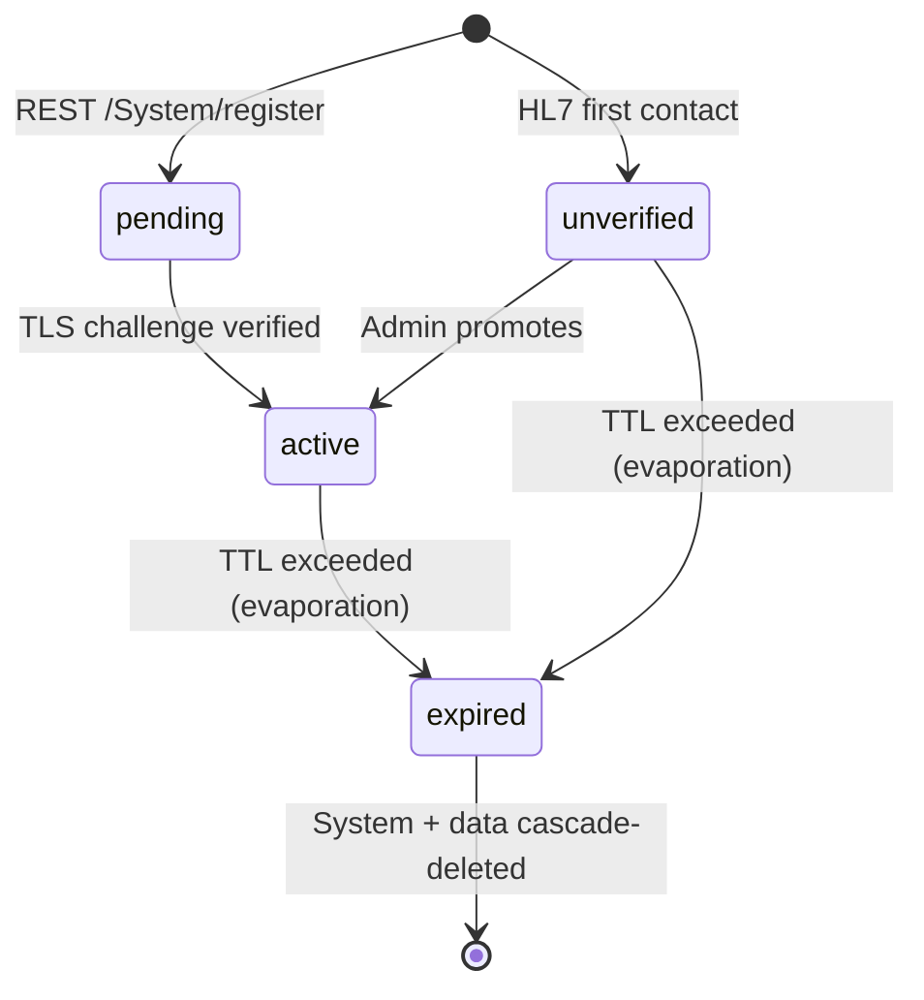

# FHIRTogether Architecture Diagram

## System Overview



## Multi-Tenant Data Model



## System Onboarding Flows

### HL7 Zero-Friction Path



### REST Registration Path



### System Lifecycle



## Data Flow: Booking an Appointment

```
1. Client Request
   POST /Appointment
   {
     "status": "booked",
     "slot": [{"reference": "Slot/123"}],
     "participant": [...]
   }
          │
          ▼
2. Route Handler (appointmentRoutes.ts)
   - Validates request schema
   - Extracts appointment data
          │
          ▼
3. Store Layer
   - Creates appointment record
   - Extracts slot references
   - Updates slot status to "busy"
          │
          ▼
4. Database
   - INSERT into appointments table
   - UPDATE slots SET status='busy'
          │
          ▼
5. Response to Client
   {
     "resourceType": "Appointment",
     "id": "generated-id",
     "status": "booked",
     ...
   }
```

## Data Generation Flow

```
npm run generate-data
       │
       ▼
generateBusyOffice.ts
       │
       ├─► 1. Clear existing data
       │      - DELETE all appointments
       │      - DELETE all slots
       │      - DELETE all schedules
       │
       ├─► 2. Create provider schedules
       │      - Dr. Smith (Family Medicine)
       │      - Dr. Johnson (Internal Medicine)
       │      - Dr. Williams (Pediatrics)
       │
       ├─► 3. Generate time slots (30 days)
       │      For each provider:
       │        For each working day:
       │          Create slots from start to end time
       │          (based on appointment duration)
       │
       ├─► 4. Book appointments (~75% fill)
       │      For each provider:
       │        Select random slots
       │        Create patient references
       │        Book appointments
       │        Mark slots as busy
       │
       └─► 5. Display statistics
              - Total schedules, slots, appointments
              - Fill rate
              - Avg appointments per provider/day
```

## Request/Response Examples

### Search for Free Slots

```
Request:
GET /Slot?schedule=Schedule/12345&status=free&start=2025-12-10T00:00:00Z

Response:
{
  "resourceType": "Bundle",
  "type": "searchset",
  "total": 45,
  "entry": [
    {
      "fullUrl": "http://localhost:4010/Slot/slot-1",
      "resource": {
        "resourceType": "Slot",
        "id": "slot-1",
        "schedule": {
          "reference": "Schedule/12345",
          "display": "Dr. Sarah Smith"
        },
        "status": "free",
        "start": "2025-12-10T08:00:00Z",
        "end": "2025-12-10T08:20:00Z",
        "serviceType": [{"text": "Family Medicine"}]
      }
    },
    ...
  ]
}
```

### Book an Appointment

```
Request:
POST /Appointment
{
  "resourceType": "Appointment",
  "status": "booked",
  "description": "Annual Physical",
  "slot": [{"reference": "Slot/slot-1"}],
  "participant": [
    {
      "actor": {
        "reference": "Practitioner/practitioner-smith",
        "display": "Dr. Sarah Smith"
      },
      "status": "accepted"
    },
    {
      "actor": {
        "reference": "Patient/patient-123",
        "display": "Jane Doe"
      },
      "status": "accepted"
    }
  ]
}

Response:
{
  "resourceType": "Appointment",
  "id": "1733755200000-abc123xyz",
  "status": "booked",
  "description": "Annual Physical",
  "start": "2025-12-10T08:00:00Z",
  "end": "2025-12-10T08:20:00Z",
  "slot": [{"reference": "Slot/slot-1"}],
  "participant": [...],
  "meta": {
    "lastUpdated": "2025-12-09T13:00:00.000Z"
  }
}

Side Effect: Slot/slot-1 status changed from "free" to "busy"
```

## Technology Stack

```
┌─────────────────────────────────────────────┐
│              Application Layer              │
│  • TypeScript (Type Safety)                 │
│  • Fastify (HTTP Server)                    │
│  • @fastify/swagger (OpenAPI Docs)          │
│  • @fastify/cors (Cross-Origin)             │
└─────────────────────────────────────────────┘
                    │
┌─────────────────────────────────────────────┐
│              Data Access Layer              │
│  • FhirStore interface (pluggable backend)  │
│  • Default: SqliteStore (better-sqlite3)    │
└─────────────────────────────────────────────┘
                    │
┌─────────────────────────────────────────────┐
│             Storage Layer                   │
│  • Pluggable backend (default: SQLite3)     │
│  • File-based: ./data/fhirtogether.db       │
└─────────────────────────────────────────────┘
```

## File Dependencies

```
server.ts
├── imports dotenv (.env config)
├── imports SqliteStore
│   └── requires Database from better-sqlite3
│   └── implements FhirStore interface (types/fhir.ts)
├── imports registerApiKeyAuth (auth/apiKeyAuth.ts)
│   └── imports validateBasicAuth (auth/basicAuth.ts)
├── imports createMLLPServer (hl7/socket.ts)
├── registers routes/
│   ├── systemRoutes.ts     (System registration + management)
│   ├── locationRoutes.ts   (Location CRUD)
│   ├── directoryRoutes.ts  (Public provider directory)
│   ├── scheduleRoutes.ts
│   ├── slotRoutes.ts
│   ├── appointmentRoutes.ts
│   ├── hl7Routes.ts        (HL7v2 SIU ingestion)
│   └── importRoutes.ts
├── starts evaporation timer
└── registers swagger plugins

generateBusyOffice.ts
└── imports SqliteStore
    └── uses FHIR types (Schedule, Slot, Appointment)
```

## Environment Configuration Flow

```
.env file
  ↓
dotenv loads into process.env
  ↓
server.ts reads config
  ├── PORT (default: 4010)
  ├── HOST (default: 0.0.0.0)
  ├── STORE_BACKEND (default: sqlite)
  ├── LOG_LEVEL (default: info)
  ├── ENABLE_TEST_ENDPOINTS (default: true)
  ├── AUTH_USERNAME / AUTH_PASSWORD (admin Basic Auth)
  ├── SYSTEM_TTL_DAYS (default: 7)
  ├── EVAPORATION_CHECK_INTERVAL_HOURS (default: 1)
  └── DIRECTORY_SHOW_UNVERIFIED (default: false)
  ↓
Store backend reads config (e.g. SQLITE_DB_PATH)
  ↓
Creates/opens database (e.g. ./data/fhirtogether.db)
```

## Busy Office Simulation

```
3 Providers × 9 hours/day × 60 min/hour ÷ 20 min/appt = ~81 slots/provider/day
3 Providers × 81 slots × 21 working days (30 days) = ~5,103 total slots
5,103 slots × 75% fill rate = ~3,827 appointments
3,827 appointments ÷ 3 providers ÷ 21 days = ~60 appointments/provider/day
```

## API Endpoint Matrix

| Resource    | GET (search) | GET (by ID) | POST (create) | PUT (update) | DELETE |
|-------------|--------------|-------------|---------------|--------------|--------|
| System      | ✅           | —           | ✅ (register) | ✅           | ✅     |
| Location    | ✅           | ✅          | ✅            | ✅           | ✅     |
| Directory   | ✅ (public)  | —           | —             | —            | —      |
| Schedule    | ✅           | ✅          | ✅            | ✅           | ✅*    |
| Slot        | ✅           | ✅          | ✅            | ✅           | ✅*    |
| Appointment | ✅           | ✅          | ✅            | ✅           | ✅     |

*Requires ENABLE_TEST_ENDPOINTS=true

## Query Parameters Supported

### /System
- Admin: returns all systems
- Bearer: returns own system details

### /Location
- `zip` - Filter by zip code
- `_count` - Limit results

### /Directory (public)
- `zip` - Filter by zip code
- `specialty` - Filter by provider specialty
- `name` - Filter by provider or system name
- `status` - Filter by system status (active/unverified/all)
- `_format` - Response format (fhir/json/yaml/hl7)

### /Schedule
- `actor` - Filter by practitioner reference
- `active` - Filter by active status (true/false)
- `date` - Filter by date within planning horizon
- `_count` - Limit results

### /Slot
- `schedule` - Filter by schedule reference
- `status` - Filter by status (free/busy/busy-unavailable/busy-tentative)
- `start` - Filter slots starting after this datetime
- `end` - Filter slots ending before this datetime
- `_count` - Limit results

### /Appointment
- `date` - Filter by appointment date
- `status` - Filter by appointment status
- `patient` - Filter by patient reference
- `actor` - Filter by any participant actor
- `_count` - Limit results
