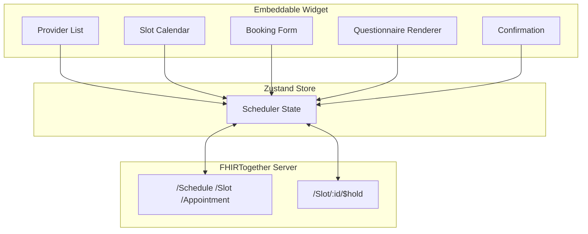
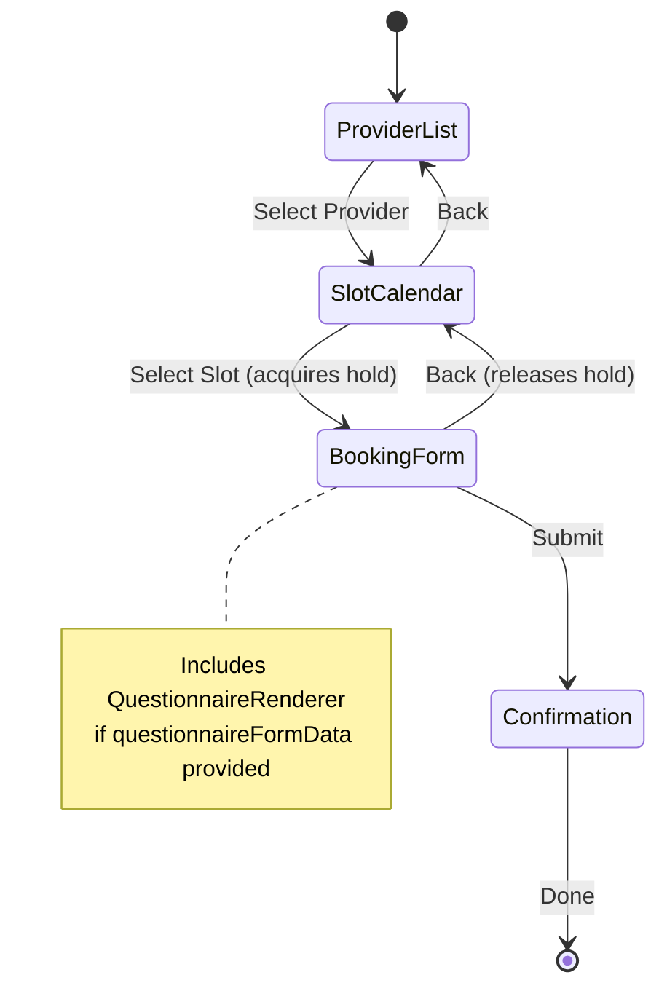

# Embeddable FHIR Scheduler Component

**`@mieweb/fhir-scheduler`** — A React component for browsing provider schedules and booking appointments, embeddable in any application.

---

## 🎯 Overview

A self-contained scheduling widget similar to [cal.com](https://cal.com) or [Calendly](https://calendly.com) that:

- Displays provider availability from any FHIR-compliant server
- Allows anonymous users to browse and book appointments
- Integrates with `@mieweb/forms-renderer` for patient intake questionnaires
- Provides slot hold/locking to prevent double-booking
- Ships as React component, Web Component, and optional Blaze template



---

## 📦 Package Structure

```
packages/fhir-scheduler/
├── package.json
├── vite.config.ts
├── vite.config.standalone.ts
├── tsconfig.json
├── index.ts                    # React component exports
├── src/
│   ├── api/
│   │   └── fhirClient.ts       # FHIR API client with typed methods
│   ├── store/
│   │   └── schedulerStore.ts   # Zustand state management
│   ├── components/
│   │   ├── ProviderList.tsx    # Provider selection grid
│   │   ├── SlotCalendar.tsx    # Date picker + time slots
│   │   ├── BookingForm.tsx     # Patient info + questionnaire
│   │   ├── Confirmation.tsx    # Success/failure display
│   │   └── SchedulerWidget.tsx # Main orchestrator component
│   ├── types/
│   │   └── index.ts            # TypeScript interfaces
│   ├── styles/
│   │   └── scheduler.css       # Tailwind-based styles
│   └── web-component.ts        # Custom element wrapper
└── README.md
```

---

## 🔧 Installation

### React App
```bash
npm install @mieweb/fhir-scheduler react react-dom
```

### Standalone (No React Required)
```html
<script type="module">
  import '@mieweb/fhir-scheduler/standalone';
</script>
```

---

## 🚀 Usage

### React Component

```tsx
import { SchedulerWidget } from '@mieweb/fhir-scheduler';

function App() {
  const handleComplete = (appointment) => {
    console.log('Booked:', appointment);
  };

  return (
    <SchedulerWidget
      fhirBaseUrl="https://api.example.com/fhir"
      onComplete={handleComplete}
    />
  );
}
```

### With Questionnaire Integration

```tsx
import { SchedulerWidget } from '@mieweb/fhir-scheduler';

const intakeQuestionnaire = {
  schemaType: 'mieforms-v1.0',
  fields: [
    {
      id: 'sec-patient',
      fieldType: 'section',
      title: 'Patient Information',
      fields: [
        { id: 'q-reason', fieldType: 'text', question: 'Reason for visit' },
        { id: 'q-insurance', fieldType: 'text', question: 'Insurance provider' },
        {
          id: 'q-newpatient',
          fieldType: 'radio',
          question: 'Are you a new patient?',
          options: [
            { id: 'yes', value: 'Yes' },
            { id: 'no', value: 'No' }
          ]
        }
      ]
    }
  ]
};

function App() {
  return (
    <SchedulerWidget
      fhirBaseUrl="https://api.example.com/fhir"
      questionnaireFormData={intakeQuestionnaire}
      holdDurationMinutes={10}
      onComplete={(appt) => console.log('Booked:', appt)}
    />
  );
}
```

### Pre-selected Provider

```tsx
<SchedulerWidget
  fhirBaseUrl="https://api.example.com/fhir"
  providerId="Schedule/dr-smith-123"
  onComplete={handleComplete}
/>
```

### Web Component

```html
<fhir-scheduler
  fhir-base-url="https://api.example.com/fhir"
  hold-duration="10"
></fhir-scheduler>

<script type="module">
  import '@mieweb/fhir-scheduler/standalone';

  const scheduler = document.querySelector('fhir-scheduler');
  
  // Set questionnaire programmatically
  scheduler.questionnaireFormData = { /* ... */ };
  
  // Listen for completion
  scheduler.addEventListener('complete', (e) => {
    console.log('Appointment booked:', e.detail);
  });
</script>
```

---

## 📋 Props / Attributes

| Prop | Type | Default | Description |
|------|------|---------|-------------|
| `fhirBaseUrl` | `string` | *required* | Base URL of FHIR server |
| `providerId` | `string` | `undefined` | Pre-select a specific provider (skip provider list) |
| `questionnaireFormData` | `object` | `undefined` | MIE Forms or SurveyJS questionnaire schema |
| `holdDurationMinutes` | `number` | `5` | How long to hold a slot during booking |
| `onComplete` | `(appt) => void` | `undefined` | Callback when booking succeeds |
| `onError` | `(error) => void` | `undefined` | Callback on booking failure |
| `className` | `string` | `''` | Additional CSS classes |

---

## 🗄️ Zustand State Store

```typescript
interface SchedulerState {
  // Data
  providers: Schedule[];
  slots: Slot[];
  
  // Selection
  selectedProvider: Schedule | null;
  selectedDate: string | null;
  selectedSlot: Slot | null;
  
  // Hold management
  holdToken: string | null;
  holdExpiresAt: Date | null;
  
  // Booking flow
  step: 'providers' | 'calendar' | 'booking' | 'confirmation';
  patientInfo: PatientInfo | null;
  questionnaireResponse: QuestionnaireResponse | null;
  
  // Status
  loading: boolean;
  error: string | null;
  bookedAppointment: Appointment | null;
  
  // Actions
  fetchProviders: () => Promise<void>;
  selectProvider: (provider: Schedule) => void;
  fetchSlots: (date: string) => Promise<void>;
  selectSlot: (slot: Slot) => Promise<void>;  // Acquires hold
  releaseHold: () => Promise<void>;
  setPatientInfo: (info: PatientInfo) => void;
  setQuestionnaireResponse: (response: QuestionnaireResponse) => void;
  submitBooking: () => Promise<Appointment>;
  reset: () => void;
}
```

---

## 🔒 Slot Hold/Locking API

To prevent double-booking during the checkout process, the scheduler acquires a temporary hold on the selected slot.

### Server-Side Implementation

Add to `FhirStore` interface:

```typescript
interface SlotHold {
  id: string;
  slotId: string;
  holdToken: string;
  sessionId: string;
  expiresAt: string;
  createdAt: string;
}

interface FhirStore {
  // ... existing methods ...
  
  // Slot hold operations
  holdSlot(slotId: string, sessionId: string, durationMinutes: number): Promise<SlotHold>;
  releaseHold(holdToken: string): Promise<void>;
  getActiveHold(slotId: string): Promise<SlotHold | null>;
  cleanupExpiredHolds(): Promise<number>;
}
```

### New API Endpoints

| Method | Path | Description |
|--------|------|-------------|
| POST | `/Slot/:id/$hold` | Acquire hold on a slot |
| DELETE | `/Slot/:id/$hold/:token` | Release a hold |
| GET | `/Slot/:id/$hold` | Check if slot is held |

### Hold Request/Response

```typescript
// POST /Slot/slot-123/$hold
// Request
{
  "durationMinutes": 10,
  "sessionId": "client-uuid-abc123"
}

// Response
{
  "holdToken": "hold-xyz789",
  "slotId": "slot-123",
  "expiresAt": "2025-12-10T14:30:00Z",
  "status": "held"
}
```

### Database Schema

```sql
CREATE TABLE slot_holds (
  id TEXT PRIMARY KEY,
  slot_id TEXT NOT NULL,
  hold_token TEXT UNIQUE NOT NULL,
  session_id TEXT NOT NULL,
  expires_at TEXT NOT NULL,
  created_at TEXT DEFAULT CURRENT_TIMESTAMP,
  FOREIGN KEY (slot_id) REFERENCES slots(id) ON DELETE CASCADE
);

CREATE INDEX idx_slot_holds_slot ON slot_holds(slot_id);
CREATE INDEX idx_slot_holds_expires ON slot_holds(expires_at);
```

### Booking with Hold Validation

```typescript
// POST /Appointment
{
  "resourceType": "Appointment",
  "slot": [{ "reference": "Slot/slot-123" }],
  "participant": [...],
  // Extension for hold token validation
  "_holdToken": "hold-xyz789"
}

// If hold is expired or doesn't match → HTTP 409 Conflict
// If hold is valid → Book appointment, delete hold, mark slot busy
```

---

## 🔌 FHIR API Client

```typescript
// src/api/fhirClient.ts

export interface FhirClientConfig {
  baseUrl: string;
  headers?: Record<string, string>;
}

export function createFhirClient(config: FhirClientConfig) {
  const { baseUrl, headers = {} } = config;
  
  return {
    async getProviders(): Promise<Schedule[]> {
      const res = await fetch(`${baseUrl}/Schedule?active=true`, { headers });
      const bundle = await res.json();
      return bundle.entry?.map(e => e.resource) || [];
    },
    
    async getSlots(scheduleId: string, start: string, end: string): Promise<Slot[]> {
      const params = new URLSearchParams({
        schedule: scheduleId,
        status: 'free',
        start: `ge${start}`,
        end: `le${end}`
      });
      const res = await fetch(`${baseUrl}/Slot?${params}`, { headers });
      const bundle = await res.json();
      return bundle.entry?.map(e => e.resource) || [];
    },
    
    async holdSlot(slotId: string, durationMinutes = 5): Promise<SlotHold> {
      const res = await fetch(`${baseUrl}/Slot/${slotId}/$hold`, {
        method: 'POST',
        headers: { 'Content-Type': 'application/json', ...headers },
        body: JSON.stringify({ durationMinutes, sessionId: getSessionId() })
      });
      if (!res.ok) throw new Error('Failed to hold slot');
      return res.json();
    },
    
    async releaseHold(slotId: string, holdToken: string): Promise<void> {
      await fetch(`${baseUrl}/Slot/${slotId}/$hold/${holdToken}`, {
        method: 'DELETE',
        headers
      });
    },
    
    async bookAppointment(
      slot: Slot,
      patientInfo: PatientInfo,
      holdToken: string,
      questionnaireResponse?: QuestionnaireResponse
    ): Promise<Appointment> {
      const appointment = {
        resourceType: 'Appointment',
        status: 'booked',
        slot: [{ reference: `Slot/${slot.id}` }],
        start: slot.start,
        end: slot.end,
        participant: [
          {
            actor: { display: patientInfo.name },
            status: 'accepted'
          }
        ],
        comment: patientInfo.reason,
        _holdToken: holdToken,
        // Attach questionnaire response as contained resource
        contained: questionnaireResponse ? [questionnaireResponse] : undefined
      };
      
      const res = await fetch(`${baseUrl}/Appointment`, {
        method: 'POST',
        headers: { 'Content-Type': 'application/json', ...headers },
        body: JSON.stringify(appointment)
      });
      
      if (res.status === 409) {
        throw new Error('Slot is no longer available');
      }
      if (!res.ok) throw new Error('Booking failed');
      return res.json();
    }
  };
}
```

---

## 🎨 Component Flow



---

## 📱 Responsive Design

The widget adapts to container width:

| Width | Layout |
|-------|--------|
| < 480px | Single column, stacked cards |
| 480-768px | Two columns for slots |
| > 768px | Full calendar grid view |

---

## 🔗 Integration with questionnaire-builder

The scheduler uses `@mieweb/forms-renderer` to display intake questionnaires during the booking step:

```tsx
// Inside BookingForm.tsx
import { QuestionnaireRenderer, buildQuestionnaireResponse, useFieldsArray } from '@mieweb/forms-renderer';

function BookingForm({ questionnaireFormData, onQuestionnaireChange }) {
  const currentFields = useFieldsArray();
  
  const handleFormChange = (data) => {
    const response = buildQuestionnaireResponse(currentFields, 'intake-questionnaire');
    onQuestionnaireChange(response);
  };
  
  return (
    <div>
      {/* Patient info fields */}
      <PatientInfoFields />
      
      {/* Embedded questionnaire */}
      {questionnaireFormData && (
        <QuestionnaireRenderer
          formData={questionnaireFormData}
          onChange={handleFormChange}
        />
      )}
      
      <button type="submit">Book Appointment</button>
    </div>
  );
}
```

---

## 🛠️ Implementation Phases

### Phase 1: Core Infrastructure ✅
- [x] Create package structure with Vite + TypeScript
- [x] Implement Zustand store with basic state
- [x] Create FHIR API client
- [x] Build ProviderList component

### Phase 2: Slot Selection ✅
- [x] Build SlotCalendar with date picker
- [x] Implement slot hold API endpoints on server
- [x] Add hold/release logic to store
- [x] Display hold countdown timer

### Phase 3: Booking Flow ✅
- [x] Create BookingForm with patient info fields
- [x] Integrate QuestionnaireRenderer using https://github.com/mieweb/questionnaire-builder/
- [x] Implement booking submission with hold validation
- [x] Build Confirmation component

### Phase 4: Polish & Distribution 🔄
- [x] Create standalone Web Component bundle
- [x] Add styles (plain CSS for compatibility)
- [x] Add Playwright E2E test scaffolding
- [ ] Write comprehensive tests
- [ ] Publish to npm

### Phase 5: Identity Management

> 📖 See [AUTH.md](packages/fhir-scheduler/docs/AUTH.md) for complete documentation.

- [ ] **Auth mode support** — `anonymous`, `token`, `callback`, `smart` modes
- [ ] **Token injection**
  - [ ] Accept static `accessToken` prop
  - [ ] Support `getAccessToken()` async refresh function
  - [ ] Auto-attach Bearer token to FHIR requests
- [ ] **Anonymous booking with verification**
  - [ ] Email verification flow (send/verify callbacks)
  - [ ] SMS verification via host-provided gateway
  - [ ] Optional CAPTCHA integration
- [ ] **Identity callback pattern**
  - [ ] `onIdentityRequired` hook for host-controlled auth
  - [ ] Support OAuth popup/redirect flows
  - [ ] Handle auth cancellation gracefully
- [ ] **Pre-populated user info**
  - [ ] Accept `user` prop with known identity
  - [ ] Skip patient info fields if verified user provided
  - [ ] Link to existing FHIR Patient resource
- [ ] **SMART on FHIR launch** (optional)
  - [ ] EHR launch context support
  - [ ] Standalone launch with authorization
  - [ ] Token refresh handling
- [ ] **Post-booking notifications**
  - [ ] Calendar integration (Google Calendar, Outlook) via email
  - [ ] SMS reminders via host-provided gateway
  - [ ] Cancelation/reschedule links


---

## 📄 License

MIT — Part of the FHIRTogether project.
