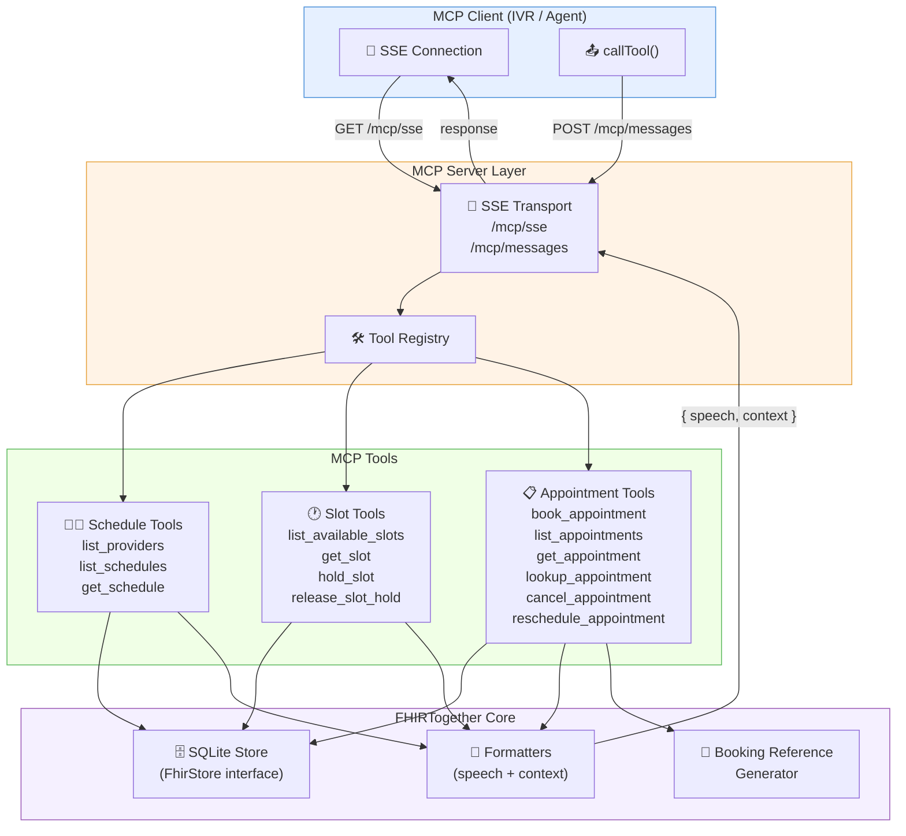
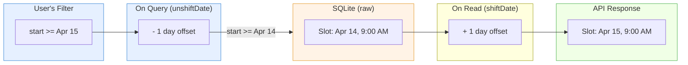

# MCP Server Implementation

FHIRTogether exposes its FHIR scheduling operations as [Model Context Protocol (MCP)](https://modelcontextprotocol.io/) tools, enabling LLM agents to discover providers, search slots, and book appointments over a standard SSE transport.

## Architecture



## Enabling the MCP Server

The MCP server is **enabled by default**. To disable it, set:

```bash
DISABLE_MCP=true node dist/server.js
```

This registers three routes on the Fastify instance:

| Endpoint | Method | Purpose |
|----------|--------|---------|
| `/mcp/sse` | GET | Establish SSE connection, returns session ID |
| `/mcp/messages` | POST | Send JSON-RPC tool calls (requires `?sessionId=`) |
| `/mcp/health` | GET | Health check with active session count |

## Tool Reference

### Provider Discovery

| Tool | Parameters | Description |
|------|-----------|-------------|
| `list_providers` | _(none)_ | Lists all active providers with their schedule IDs, practitioner references, and specialties. Call this first in the scheduling flow. |
| `list_schedules` | `active?`, `actor?`, `limit?` | Detailed schedule listing with planning horizons. |
| `get_schedule` | `schedule_id` | Single schedule by ID. |

### Slot Management

| Tool | Parameters | Description |
|------|-----------|-------------|
| `list_available_slots` | `schedule_id?`, `status?`, `start_date?`, `end_date?`, `limit?` | Search available slots. Dates accept ISO 8601 (`2026-04-15`) or full timestamps. Defaults to `status=free`. |
| `get_slot` | `slot_id` | Single slot detail. |
| `hold_slot` | `slot_id`, `session_id`, `duration_minutes?` | Temporarily hold a slot (default 15 min) to prevent double-booking. Returns a hold token. |
| `release_slot_hold` | `hold_token` | Release a previously held slot. |

### Appointment Operations

| Tool | Parameters | Description |
|------|-----------|-------------|
| `book_appointment` | `slot_id`, `patient_name`, `patient_phone?`, `reason?`, `notes?`, `hold_token?` | Book a slot. Generates a human-readable booking reference (e.g., `happy-oak-4821`). Automatically marks the slot as busy. |
| `list_appointments` | `date?`, `status?`, `patient?`, `limit?` | List appointments with optional filters. |
| `get_appointment` | `appointment_id` | Single appointment by ID. |
| `lookup_appointment` | `booking_reference` | Find an appointment by its booking reference. |
| `cancel_appointment` | `appointment_id?`, `booking_reference?`, `reason?` | Cancel by ID or booking reference. Frees the associated slots. |
| `reschedule_appointment` | `appointment_id?`, `booking_reference?`, `new_slot_id` | Move an appointment to a new slot. |

## Structured Responses: Speech vs Context

Every tool returns a **structured JSON response** with two fields so that voice-based clients (IVR, voice agents) can separate what the caller hears from what the AI needs:

```json
{
  "speech": "I found 9 available time slots. The times are: 9:00 AM, 10:00 AM, 11:00 AM...",
  "context": "### Slot 1\nSlot ID: 1776204444999-rg9a5ll2o\nStatus: free\nStart: Wed, Apr 15, 2026, 9:00 AM\n..."
}
```

| Field | Purpose | Example |
|-------|---------|---------|
| `speech` | Short, natural language for TTS playback | _"We have Dr. Sarah Smith in Family Medicine and Dr. Michael Johnson in Internal Medicine."_ |
| `context` | Full details with IDs, references, metadata for the AI's next decision | Schedule IDs, slot IDs, service types, appointment status, booking references |

The `structuredResult()` helper in `formatters.ts` wraps these into the MCP content format:

```typescript
export function structuredResult(speech: string, context: string) {
  return {
    content: [{ type: 'text', text: JSON.stringify({ speech, context }) }],
  };
}
```

Clients that don't parse JSON will receive the raw string, which still works — they'll just get both speech and context as one blob.

## Booking References

Appointments get human-readable references in the format `adjective-noun-number`:

- Pattern: `happy-oak-4821`, `bright-river-3917`, `calm-star-5062`
- Stored as a FHIR `Identifier` with system `urn:booking-reference`
- Used for phone-friendly lookup and cancellation (callers spell it using NATO phonetic alphabet)
- Generated by `bookingReference.ts` from curated word lists (24 adjectives × 24 nouns × 9000 numbers)

## Date Shifting (Seed Data)

The SQLite store keeps seed data "fresh" with a date-shifting mechanism:



- **Generation date** is stored in `data/seed-metadata.json` (committed to git)
- **Offset** = `today - generationDate` in days
- **`shiftDate()`** adds offset on read — so seed data from last week appears as "today"
- **`unshiftDate()`** subtracts offset on query — so filtering for "today" matches the raw DB rows
- If no seed metadata exists, offset is 0 (no shifting)

## SSE Transport Details

The MCP server uses Server-Sent Events for bidirectional communication over HTTP:

1. **Client connects** via `GET /mcp/sse` → receives a session ID in the SSE stream
2. **Client sends tool calls** via `POST /mcp/messages?sessionId=<id>` → JSON-RPC request body
3. **Server responds** via the open SSE stream with JSON-RPC results
4. **On disconnect**, the session is cleaned up automatically

Key Fastify integration details:
- `reply.hijack()` is used on both endpoints to bypass Fastify's response handling and let the MCP SDK manage headers/streaming directly
- `request.body` is passed as the third argument to `handlePostMessage()` because Fastify's body parser consumes the raw stream before the handler runs
- Sessions are keyed by `transport.sessionId` (UUID generated by the SDK)

## File Structure

```
src/mcp/
├── mcpServer.ts                # MCP server class, SSE route registration
└── tools/
    ├── scheduleTools.ts        # list_providers, list_schedules, get_schedule
    ├── slotTools.ts            # list_available_slots, get_slot, hold_slot, release_slot_hold
    ├── appointmentTools.ts     # book, list, get, lookup, cancel, reschedule
    ├── formatters.ts           # Context formatters + speech formatters + structuredResult()
    └── bookingReference.ts     # Human-readable reference generator
```

## Dependencies

| Package | Purpose |
|---------|---------|
| `@modelcontextprotocol/sdk` | MCP server + SSE transport |
| `zod` | Tool parameter validation and schema generation |
| `better-sqlite3` | SQLite database driver |

## Testing with VS Code

VS Code's Copilot Chat can connect to the MCP server and use the scheduling tools directly in agent mode.

### Setup

1. **Start the server** with seed data:

   ```bash
   npm run build
   npm run generate-data   # creates providers, schedules, and slots
   node dist/server.js
   ```

2. **The MCP config is already in the repo** at `.vscode/mcp.json`:

   ```json
   {
     "servers": {
       "fhirtogether": {
         "type": "sse",
         "url": "http://localhost:4010/mcp/sse"
       }
     }
   }
   ```

3. **Open Copilot Chat** in agent mode (not ask/edit mode) and you'll see the FHIRTogether tools available.

### Example Conversation

Try asking Copilot Chat in agent mode:

> "I'd like to book a checkup appointment"

The agent will:
1. Call `list_providers` to discover available doctors
2. Call `list_available_slots` to find open times
3. Ask you to pick a time and provide your name
4. Call `book_appointment` to confirm the booking
5. Return a booking reference like `brave-wind-3471`

You can then say:

> "Cancel that appointment"

And the agent will call `cancel_appointment` with the booking reference.

### Available Tools

Once connected, these MCP tools appear in Copilot Chat:

| Tool | What it does |
|------|-------------|
| `list_providers` | Discover doctors and their specialties |
| `list_schedules` | Browse schedules with planning horizons |
| `list_available_slots` | Find open time slots for a provider |
| `hold_slot` / `release_slot_hold` | Temporarily reserve a slot |
| `book_appointment` | Book a slot for a patient |
| `lookup_appointment` | Find appointment by booking reference |
| `get_appointment` | Get appointment details by ID |
| `list_appointments` | Browse appointments with filters |
| `cancel_appointment` | Cancel by ID or booking reference |
| `reschedule_appointment` | Move to a different time slot |
| `get_schedule` / `get_slot` | Get details for a single resource |

### Troubleshooting

- **Auth errors**: MCP endpoints (`/mcp/*`) are public — no API key needed. If you see auth errors, rebuild and restart the server.
- **No tools visible**: Make sure the server is running on port 4010 and Copilot Chat is in **agent mode** (not ask or edit mode).
- **Stale data**: Seed data shifts dates automatically, but if slots look wrong, run `npm run generate-data` again.
| `fastify` | HTTP server framework |
