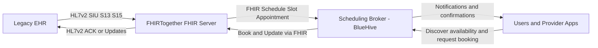

# FHIRTogether Scheduling Synapse

**FHIR-compliant gateway and test server for schedule and appointment availability.**

---

## 🧠 Overview

**FHIRTogether Scheduling Synapse** is a TypeScript + Fastify server designed to help **modernize legacy scheduling systems** by offering a **standards-compliant FHIR interface** over pluggable backend stores. It supports **FHIR `Schedule`, `Slot`, and `Appointment` resources** and can ingest **HL7v2 SIU messages**, making it ideal for:

- Acting as a **gateway** between legacy/proprietary EHRs and modern clients
- Serving as a **test server** to prototype or simulate provider group schedules
- Enabling **public applications** to discover and book available time

---

## 🔥 Key Features

- ✅ Full support for FHIR R4 RESTful APIs:
  - `/Schedule`, `/Slot`, `/Appointment`
- 🔁 HL7v2 message ingestion (`SIU^S12`, `S13`, `S15`)
- 🧩 Pluggable backend support: MongoDB, MySQL, PostgreSQL, MSSQL
- 🌐 OpenAPI 3.1 (Swagger UI) auto-generated from routes
- 🧪 Test mode for seeding schedules, clearing data, or simulating providers
- ⚡ Fastify-based, modern TypeScript stack



---

## 🛠 Use Case: Making Legacy Systems FHIR-Compliant

If you're working with a proprietary scheduling system that stores appointment data in a non-standard format (e.g., mainframe, custom RDBMS, HL7v2-only systems), **FHIRTogether** allows you to:

1. Implement a storage engine that adapts your system's internal schema to the FHIR `Slot`, `Schedule`, and `Appointment` structure.
2. Optionally translate HL7v2 `SIU` messages into storage-compatible entries.
3. Instantly expose a **FHIR-native API** over your legacy data.

No need to re-architect your legacy system — just implement a backend adapter.

## 🚀 Quickstart

```bash
git clone https://github.com/mieweb/FHIRTogether.git
cd FHIRTogether
npm install
npm run dev
````

Swagger UI: [http://localhost:4010/docs](http://localhost:4010/docs)

## 🧩 Pluggable Store Interface

To integrate with your system, implement the `FhirStore` interface:

```ts
interface FhirStore {
  getSlots(query: FhirSlotQuery): Promise<Slot[]>;
  createSlot(slot: Slot): Promise<Slot>;
  getSchedules(query: FhirScheduleQuery): Promise<Schedule[]>;
  createSchedule(schedule: Schedule): Promise<Schedule>;
  createAppointment(appt: Appointment): Promise<Appointment>;
}
```

Backend modules are located in `/src/store/`:

* `mongoStore.ts` - Example for your mongoDB as your backend
* `postgresStore.ts` - for postgres
* `mysqlStore.ts` - MariaDB and MySQL example
* `mssqlStore.ts` - Microsoft SQL Server
* `simulator.ts` - a Simulator showing specific results for testing with an in-memory backend (no persistance) and examples initiated at launch.

Use the `.env` file to select your backend (defaults to simulator):

```env
STORE_BACKEND=postgres
```

---

## 🔄 HL7v2 Message Ingest

Send HL7v2 scheduling messages (e.g., `SIU^S12`, `S13`, `S15`) to:

```
POST /$hl7v2-ingest
```

```json
{
  "message": "MSH|^~\\&|SCHED|...<raw HL7v2>",
  "sourceSystem": "LegacyScheduler"
}
```

The server parses the message and converts it into FHIR `Slot` and `Schedule` resources internally.

## 📦 API Endpoints

FHIR-compliant endpoints (all responses follow FHIR Bundles or resource schemas):

| Method | Path             | Description                      |
| ------ | ---------------- | -------------------------------- |
| GET    | `/Slot`          | Search for free/busy slots       |
| POST   | `/Slot`          | Block a time slot                |
| GET    | `/Schedule`      | Retrieve provider availability   |
| POST   | `/Schedule`      | Define provider planning horizon |
| POST   | `/Appointment`   | Book an appointment              |
| POST   | `/$hl7v2-ingest` | Ingest HL7v2 scheduling msg      |

## 🧪 Test Server Mode

Endpoints also support administrative operations (in test mode only):

* `DELETE /Slot`
* `DELETE /Schedule`
* `POST /$simulate-week` — generate random provider availability

## 🔐 Auth (Optional)

FHIR-style bearer token authentication is planned. You can stub in simple token-based headers using the `authPlugin`.

## 📄 License

MIT

## 🤝 Contributing

If you're modernizing a legacy EHR or want to contribute HL7v2 mappings, backend drivers, or scheduler logic — PRs welcome!

## 🧭 Roadmap

* [ ] Implement an optional no-login scheduling portal for browsing schedules and booking like Calend.ly.
* [ ] Add login/authentication support for admins
* [ ] Implement google/microsoft/apple login for the scheduling portal for end users
* [ ] FHIR Subscription support for appointment updates
* [ ] Add SMART-on-FHIR / OAuth support - review https://github.com/mieweb/poc-auth-architecture 
* [ ] `$find-appointment` operation
* [ ] HL7v2 SRM^S03 request/response handling
* [ ] FHIR Bulk Export for schedules

---

## 🛡️ Project Goal

> Bring legacy scheduling infrastructure into the FHIR world — one appointment at a time.

