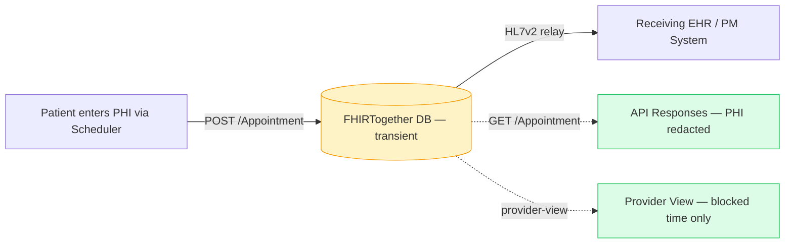
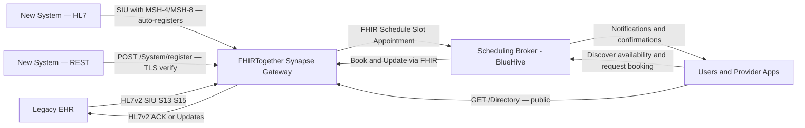

# FHIRTogether Scheduling Synapse

**FHIR-compliant gateway and test server for schedule and appointment availability.**

---

## 🧠 Overview

**FHIRTogether Scheduling Synapse** is a TypeScript + Fastify server designed to help **modernize legacy scheduling systems** by offering a **standards-compliant FHIR interface** over pluggable backend stores. It supports **FHIR `Schedule`, `Slot`, and `Appointment` resources** and can ingest **HL7v2 SIU messages**, making it ideal for:

- Acting as a **gateway** between legacy/proprietary EHRs and modern clients
- Serving as a **test server** to prototype or simulate provider group schedules
- Enabling **public applications** to discover and book available time

## Sandbox Environment

We are hosinting a public sandbox environment for testing and development at: https://fhirtogether.os.mieweb.org/ 

We have an Enterprise Health EHR and WebChart EHR sandbox environment available for testing and development. If you want to test with real EHR data or simulate HL7v2 message ingestion, please reach out to us to get access.  If you would like to add your own EHR sandbox environment to the public testing environment, please reach out to us as well.

https://masterdaily.dev.webchart.app/ - WebChart EHR Sandbox
https://ehbhdemo.enterprise.health - Enterprise Health EHR Sandbox

## 🔒 PHI/PII Policy — Trap Door Model

FHIRTogether is **not a system of record** for patient data. It acts as a scheduling gateway that relays information between patients and providers. PHI/PII is handled with a **trap door** model:

- **PHI goes in but doesn't come out.** Patient information (name, phone, email, date of birth, reason for visit) can be submitted when booking an appointment, but the API **never returns it** in subsequent responses.
- **API responses are redacted.** All `GET /Appointment` and `GET /Appointment/:id` responses strip patient participant display names, comments (which may contain reason for visit), and contained resources (which may contain questionnaire responses with PHI).
- **POST responses are also redacted.** Even the response to a booking request does not echo back patient information.
- **The provider view shows blocked time, not patient identities.** The provider appointment view displays when time slots are booked, their status, and their type — but not who booked them.
- **PHI in the database is transient.** Patient information is stored only long enough to be relayed to the receiving system (e.g., via HL7v2 SIU messages). It is not intended for long-term storage in FHIRTogether.

> **In short:** You can enter patient information through the scheduler, but FHIRTogether will never show it back to you or anyone else through the API or UI. The source EHR/PM system remains the authoritative source for patient data.


```mermaid
flowchart LR
  Patient[Patient enters PHI via Scheduler]
  DB[(FHIRTogether DB — transient)]
  EHR[Receiving EHR / PM System]
  API[API Responses — PHI redacted]
  PV[Provider View — blocked time only]

  Patient -->|POST /Appointment| DB
  DB -->|HL7v2 relay| EHR
  DB -.->|GET /Appointment| API
  DB -.->|provider-view| PV

  style DB fill:#fef3c7,stroke:#f59e0b
  style API fill:#dcfce7,stroke:#22c55e
  style PV fill:#dcfce7,stroke:#22c55e
```


---

## 🔥 Key Features

- ✅ Full support for FHIR R4 RESTful APIs:
  - `/Schedule`, `/Slot`, `/Appointment`
- 🔁 HL7v2 message ingestion (`SIU^S12`, `S13`, `S15`) via HTTP and MLLP socket
- 🏥 **Multi-tenant synapse gateway** — systems self-register via HL7 or REST
- 🔑 **Two onboarding paths**: zero-friction HL7 (MSH-4/MSH-8) and REST with TLS challenge-response
- 🌐 **Public provider directory** (`/Directory`) in FHIR, JSON, YAML, and HL7v2 MFN formats
- ⏱️ **System evaporation** — inactive systems auto-expire after configurable TTL
- 🧩 Pluggable backend support: MongoDB, MySQL, PostgreSQL, MSSQL
- 🌐 OpenAPI 3.1 (Swagger UI) auto-generated from routes
- 🧪 Test mode for seeding schedules, clearing data, or simulating providers
- ⚡ Fastify-based, modern TypeScript stack


```mermaid
flowchart LR
  A[Legacy EHR]
  B[FHIRTogether Synapse Gateway]
  C[Scheduling Broker - BlueHive]
  D[Users and Provider Apps]
  E[New System — HL7]
  F[New System — REST]

  E -->|SIU with MSH-4/MSH-8 — auto-registers| B
  F -->|POST /System/register — TLS verify| B
  A -->|HL7v2 SIU S13 S15| B
  B -->|FHIR Schedule Slot Appointment| C
  C -->|Book and Update via FHIR| B
  B -->|HL7v2 ACK or Updates| A
  D -->|Discover availability and request booking| C
  D -->|GET /Directory — public| B
  C -->|Notifications and confirmations| D
```

---

## 🏥 Multi-Tenant Synapse Gateway

FHIRTogether operates as a **unified multi-tenant gateway**. Every system (EHR, clinic, hospital) that connects becomes a tenant — either automatically via HL7 or explicitly via REST registration.

### Onboarding Path 1: Zero-Friction HL7

Just start sending SIU messages. FHIRTogether auto-registers the system using:
- **MSH-4** (Sending Facility) as identity
- **MSH-8** (Security) as shared secret

> **Try it now:** The [HL7 Message Tester](/hl7-tester) page provides editable example SIU messages you can send directly to the API — no tools required.

On first contact, the system is created as `unverified`. Subsequent messages with the same MSH-4 must match MSH-8 or are rejected. Locations are auto-created from AIL segments.

### Onboarding Path 2: REST API Registration

1. `POST /System/register` with your name and URL → receive a challenge token
2. Serve the token at `{url}/.well-known/fhirtogether-verify`
3. `POST /System/{id}/verify` → FHIRTogether fetches the token over TLS, verifies, and returns a one-time API key
4. Use `Authorization: Bearer <api-key>` for all subsequent requests

### System Lifecycle

Systems follow a trust progression: `unverified` → `pending` → `active` → `expired`

- **Unverified**: Auto-created via HL7. Can send data but not yet trusted.
- **Pending**: Registered via REST, awaiting TLS challenge verification.
- **Active**: Verified. Full API access.
- **Expired**: Evaporated after TTL days of inactivity. All data cascade-deleted.

### System Evaporation

Inactive systems automatically expire. Configurable via:
- `SYSTEM_TTL_DAYS` (default: 7) — days of inactivity before expiration
- `EVAPORATION_CHECK_INTERVAL_HOURS` (default: 1) — how often the eviction job runs

### Public Provider Directory

`GET /Directory` is public (no auth required) and supports four output formats:

| Format | Content-Type | `_format` param |
|--------|-------------|-----------------|
| FHIR Bundle (Organization + Location + PractitionerRole) | `application/fhir+json` | `fhir` |
| JSON | `application/json` | `json` |
| YAML | `text/yaml` | `yaml` |
| HL7v2 MFN^M02 | `x-application/hl7-v2+er7` | `hl7` |

Query parameters: `zip`, `specialty`, `name`, `status`

---

## 🛠 Use Case: Making Legacy Systems FHIR-Compliant

If you're working with a proprietary scheduling system that stores appointment data in a non-standard format (e.g., mainframe, custom RDBMS, HL7v2-only systems), **FHIRTogether** allows you to:

1. Implement a storage engine that adapts your system's internal schema to the FHIR `Slot`, `Schedule`, and `Appointment` structure.
2. Optionally translate HL7v2 `SIU` messages into storage-compatible entries.
3. Instantly expose a **FHIR-native API** over your legacy data.

No need to re-architect your legacy system — just implement a backend adapter.

## 🚀 Quickstart

```bash
git clone https://github.com/mieweb/FHIRTogether.git
cd FHIRTogether
npm install
npm run dev
````

Swagger UI: [http://localhost:4010/docs](http://localhost:4010/docs)

## 🧩 Pluggable Store Interface

**Important:** The store interface is **not** for connecting directly to your EHR or Practice Management system. Instead, it's a **working data repository** for the scheduling portal that holds appointment data representing schedules for providers/resources.

### Understanding the Store

The store you select is:
- ✅ A **storage system you're comfortable with** (SQLite, PostgreSQL, MySQL, MongoDB, etc.)
- ✅ A **working cache** that syncs FROM your EHR or PM system
- ✅ Used to **hold appointment scheduling data** for fast queries and updates
- ❌ **NOT the source of truth** — your EHR/PM system remains authoritative
- ❌ **NOT a direct database connection** to your production EHR/PM

This architecture allows the scheduling portal to provide fast, responsive scheduling while keeping your source system's data isolated and protected.

### Implementing a Store Backend

To integrate with your preferred storage system, implement the `FhirStore` interface:

```ts
interface FhirStore {
  getSlots(query: FhirSlotQuery): Promise<Slot[]>;
  createSlot(slot: Slot): Promise<Slot>;
  getSchedules(query: FhirScheduleQuery): Promise<Schedule[]>;
  createSchedule(schedule: Schedule): Promise<Schedule>;
  createAppointment(appt: Appointment): Promise<Appointment>;
}
```

Backend modules are located in `/src/store/`:

* `mongoStore.ts` - Example for your mongoDB as your backend
* `postgresStore.ts` - for postgres
* `mysqlStore.ts` - MariaDB and MySQL example
* `mssqlStore.ts` - Microsoft SQL Server
* `simulator.ts` - a Simulator showing specific results for testing with an in-memory backend (no persistance) and examples initiated at launch.

Use the `.env` file to select your backend (defaults to simulator):

```env
STORE_BACKEND=postgres
```

---

## 🔄 HL7v2 Message Ingest

Send HL7v2 scheduling messages (e.g., `SIU^S12`, `S13`, `S15`) to:

```
POST /hl7/siu
```

> **Interactive testing:** Use the [HL7 Message Tester](/hl7-tester) to try example messages with editable MSH fields and one-click submission.

**Option 1: Raw HL7 text** (Content-Type: `text/plain` or `x-application/hl7-v2+er7`)
```
MSH|^~\&|LEGACY_EHR|MAIN_HOSPITAL|FHIRTOGETHER|SCHEDULING_GATEWAY|20231209120000||SIU^S12|12345|P|2.3
SCH|10001^10001|10001^10001|||10001|OFFICE^Office visit|reason|OFFICE|30|m|...
PID|1||42||DOE^JOHN||19800101|M|||123 Main St^^City^ST^12345||5551234567
...
```

**Option 2: JSON wrapper** (Content-Type: `application/json`)
```json
{
  "message": "MSH|^~\\&|SCHED|...<raw HL7v2>",
  "wrapMLLP": false
}
```

**Response for text requests:** Raw HL7 ACK message
```
MSH|^~\&|FHIRTOGETHER|SCHEDULING_GATEWAY|LEGACY_EHR|MAIN_HOSPITAL|20231209120001||ACK^S12|ACK12345|P|2.3
MSA|AA|12345|Message processed successfully
```

**Response for JSON requests:** JSON-wrapped ACK
```json
{
  "message": "MSH|^~\\&|FHIRTOGETHER|SCHEDULING_GATEWAY|...\rMSA|AA|12345|Message processed successfully|||"
}
```

**ACK Codes:**
- `AA` (Application Accepted) - Message processed successfully
- `AR` (Application Rejected) - Message format error, do not retry
- `AE` (Application Error) - Processing failure, can retry

The server parses the message and converts it into FHIR `Slot` and `Schedule` resources internally.

## 📦 API Endpoints

FHIR-compliant endpoints (all responses follow FHIR Bundles or resource schemas):

| Method | Path             | Auth | Description                      |
| ------ | ---------------- | ---- | -------------------------------- |
| POST   | `/System/register` | Public | Register a new system (REST onboarding) |
| POST   | `/System/:id/verify` | Public | Complete TLS challenge-response |
| GET    | `/System`        | Bearer/Admin | Get own system details (admin: list all) |
| PUT    | `/System`        | Bearer | Update system name |
| DELETE | `/System`        | Bearer | Voluntary de-registration (cascade) |
| POST   | `/System/rekey`  | Bearer | Rotate API key |
| PUT    | `/System/:id/status` | Admin | Change system verification status |
| GET    | `/Directory`     | Public | Public provider directory (FHIR/JSON/YAML/HL7) |
| POST   | `/Location`      | Bearer | Create a location |
| GET    | `/Location`      | Bearer | List locations (FHIR Bundle) |
| GET    | `/Location/:id`  | Bearer | Get location by ID |
| PUT    | `/Location/:id`  | Bearer | Update location |
| DELETE | `/Location/:id`  | Bearer | Delete location |
| GET    | `/Slot`          | Bearer | Search for free/busy slots       |
| POST   | `/Slot`          | Bearer | Block a time slot                |
| GET    | `/Schedule`      | Bearer | Retrieve provider availability   |
| POST   | `/Schedule`      | Bearer | Define provider planning horizon |
| POST   | `/Appointment`   | Bearer | Book an appointment              |
| POST   | `/hl7/siu`       | MSH-8 | Ingest HL7v2 SIU message (text or JSON) |

## 🧪 Test Server Mode

Endpoints also support administrative operations (in test mode only):

* `DELETE /Slot`
* `DELETE /Schedule`
* `POST /$simulate-week` — generate random provider availability

## 🔐 Authentication

FHIRTogether supports three authentication modes:

| Mode | Header | Use Case |
|------|--------|----------|
| **API Key (Bearer)** | `Authorization: Bearer <api-key>` | System-to-system API access |
| **Basic Auth (Admin)** | `Authorization: Basic <base64>` | Admin operations via `AUTH_USERNAME`/`AUTH_PASSWORD` |
| **MSH-8 (HL7)** | HL7 Security field | Auto-registration via HL7v2 messages |

API keys are 64-character hex strings generated during verification (`POST /System/:id/verify`). They are stored as SHA-256 hashes — the plaintext is returned exactly once and never stored. Keys can be rotated via `POST /System/rekey`.

Public endpoints (no auth required): `/health`, `/docs`, `/demo`, `/Directory`, `/System/register`, `/System/:id/verify`

## 📄 License

MIT

## 🤝 Contributing

If you're modernizing a legacy EHR or want to contribute HL7v2 mappings, backend drivers, or scheduler logic — PRs welcome!

## 🧭 Roadmap

- [x] Multi-tenant synapse gateway with system registration
- [x] Zero-friction HL7 onboarding (MSH-4/MSH-8 auto-registration)
- [x] REST onboarding with TLS challenge-response verification
- [x] API key authentication (Bearer token)
- [x] Public provider directory (/Directory) with FHIR, JSON, YAML, HL7v2 formats
- [x] System evaporation (auto-expire inactive systems)
- [x] Location management (CRUD + HL7 AIL auto-creation)
- [ ] Implement an optional no-login scheduling portal for browsing schedules and booking like https://cal.com/ or Calend.ly.
- [ ] Add login/authentication support for admins
- [ ] Implement google/microsoft/apple login for the scheduling portal for end users
- [ ] Implement the ability for an admin to define custom appointment types with different durations and constraints
  - [ ] Admin UI for managing providers, appointment types, and schedules
  - [ ] Implement yaml import/export for schedule definitions including API to update
  
- [ ] FHIR Subscription support for appointment updates
- [ ] Add SMART-on-FHIR / OAuth support - review https://github.com/mieweb/poc-auth-architecture 
- [ ] `$find-appointment` operation
- [ ] HL7v2 SRM^S03 request/response handling
- [ ] FHIR Bulk Export for schedules

---

## 🛡️ Project Goal

> Bring legacy scheduling infrastructure into the FHIR world — one appointment at a time.

