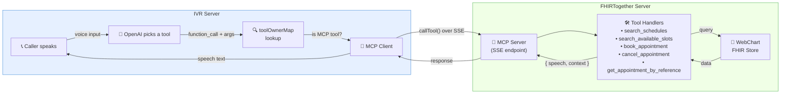

# WebChartStore Scaling Analysis

## Current Architecture

Caller speaks → OpenAI selects a tool → IVR checks if it's an MCP tool → MCP Client calls it over SSE → FHIRTogether executes it against WebChart → response flows back as speech to the caller.

## Want a demo?

Go to this youtube short - https://youtube.com/shorts/Rpim74PTr4M?si=ETsRGHlCsQb-tOvf 

## Problem

The current `WebChartStore.getSlots()` implementation computes slot availability on the fly by fetching raw data from WebChart's proprietary API and performing all filtering client-side. This approach has fundamental scaling limitations.

## How Slots Are Currently Computed

`getSlots()` makes two bulk API calls with **no server-side date filtering** (WebChart doesn't support `GE_`/`LE_` operators):

1. **`GET db/schedules`** — Fetches up to 200 schedule rows (all schedules, no date range filter)
2. **`GET db/appointments`** — Fetches up to **500** appointments (`limit: '500'`, `canceled: '0'`), also with no server-side date filtering

Then everything happens client-side:

1. Filter appointments into the requested date range in JavaScript
2. Iterate every schedule row, project recurring templates day-by-day across the query range
3. Slice each day block into **30-minute slots**
4. For **every slot generated**, run `aptRows.some()` to check overlap against **all** filtered appointments — $O(\text{slots} \times \text{appointments})$

## Why It Breaks at Scale

For a doctor booked 6 months out:

- ~180 days × ~16 slots/day = **~2,880 slots** generated per schedule
- Each slot checks overlap against potentially hundreds of appointments
- Quadratic cost: $O(S \times A)$ per query

## Specific Issues

| Issue | Impact |
|-------|--------|
| No server-side date filtering | Always fetches the latest 500 appointments, not the ones in the requested range |
| Hard `limit: 500` cap | Appointments beyond 500 are invisible → **false "free" slots** |
| $O(S \times A)$ overlap check | Quadratic cost per query |
| No pagination support | Can't iterate forward to find "next available" efficiently |
| Full schedule table scan | All 200 schedules loaded even when querying one provider |

## The Correctness Bug

The `limit: 500` cap is the most dangerous issue — it's a **correctness bug**, not just a performance concern. A doctor with ~17 appointments/day hits the 500 limit in about **30 days**, meaning anything beyond that month shows as completely open when it isn't.

## Solution: HL7-Synced Local Store

The fix is to replace direct WebChart API calls with an architecture where:

- **Schedules and appointments are synced to a local SQLite store** via HL7 SIU messages (bidirectional)
- **Slot queries hit the local SQLite store**, which has indexed columns (`idx_slots_start`, `idx_slots_status`, `idx_slots_schedule`) and supports efficient SQL date-range queries
- **Writes** (book, cancel, modify) are written locally first, then sent to WebChart as outbound HL7 SIU messages

This brings slot queries from unbounded $O(S \times A)$ HTTP-dependent computation down to **sub-100ms indexed SQL queries**.
