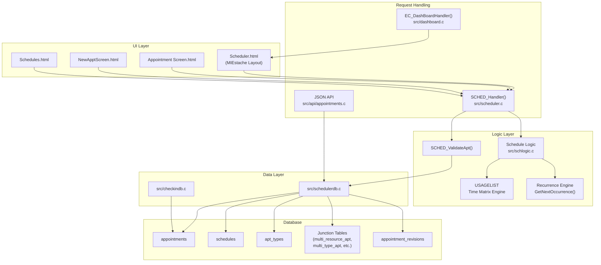
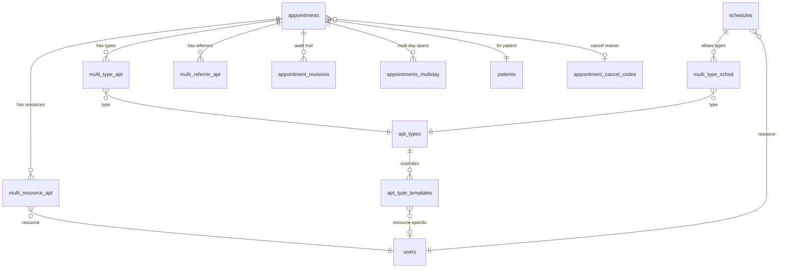
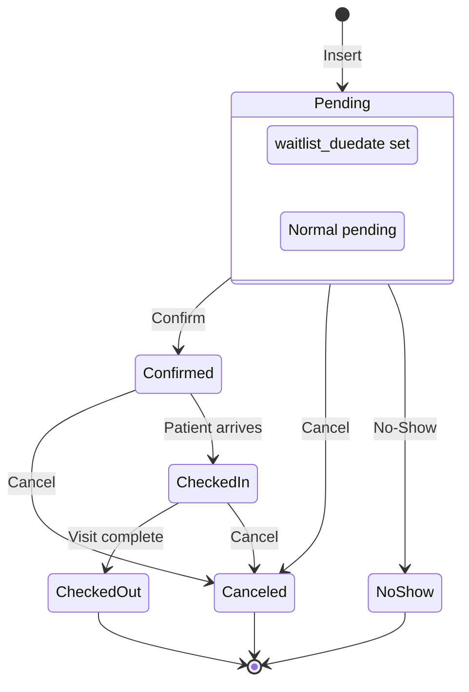

# Scheduler & Appointments

The WebChart Scheduler manages provider availability (schedules), patient appointments, appointment types, check-in/check-out, and recurrence patterns. This document describes the data model, code architecture, API, and layout system for the scheduling module.

---

## Architecture Overview



---

## Key Concepts

| Concept | Description |
|---------|-------------|
| **Schedule** | A provider's available time block. Defines *when* a resource can accept appointments. Can recur (weekly, daily, etc.). Stored in the `schedules` table. |
| **Appointment** | A patient booking in a provider's schedule. Links a patient, time, resource(s), and type(s). Stored in the `appointments` table. |
| **Resource** | A schedulable entity (provider, room, equipment). Identified by `user_id` from the `users` table. Must have the `Scheduling Resources` realm. |
| **Appointment Type** | A category of visit (e.g., "Office Visit", "Follow-Up"). Defines default duration, color, CPT code, and encounter type. Stored in `apt_types`. |
| **Recurrence** | Both schedules and appointments support repeating patterns (daily, weekly, monthly, yearly, nth-weekday). |
| **Check-In** | Patient arrival workflow tied to an appointment. Creates an encounter and tracks station/location. |

---

## Database Schema

### `appointments` — Patient bookings

| Column | Type | Description |
|--------|------|-------------|
| `id` | int (PK, auto-increment) | Appointment ID |
| `pat_id` | int (FK → patients) | Patient |
| `startdate` | datetime | Start date/time |
| `enddate` | datetime | End date/time |
| `pat_duration` | int | Patient-visible duration (minutes), can differ from slot duration |
| `waitlist_duedate` | datetime | Due date for waitlisted appointments |
| `remind` | int | Reminder offset in minutes before appointment |
| `reason` | mediumtext | Reason/chief complaint |
| `location` | varchar | Location code (e.g., `OFFICE`) |
| `status` | varchar | Appointment status |
| `comment` | mediumtext | Internal/staff comment |
| `patient_instructions` | mediumtext | Patient-facing instructions |
| `user_id` | int (FK → users) | User who created the appointment |
| `createdate` | datetime | Creation timestamp |
| `canceled` | tinyint | 0 = active, 1 = canceled/no-show |
| `cancel_code` | varchar | FK → `appointment_cancel_codes.cancel_code` |
| `cancel_date` | datetime | When canceled |
| `confirmed` | tinyint | 0 = unconfirmed, 1 = confirmed |
| `confirm_user` | int (FK → users) | Who confirmed |
| `confirm_date` | datetime | When confirmed |
| `contact` | varchar | Contact person name |
| `contact_number` | varchar | Contact phone number |
| `visible_date` | datetime | Date appointment becomes visible in portal |
| `day_overlap` | tinyint | Multi-day appointment flag |
| `interface` | varchar | External system identifier (e.g., `hl7`, `open_pm`) |
| `external_id` | varchar | ID in the external system |
| `filler_status_code` | varchar | HL7 filler status code |
| **Recurrence fields** | | See [Recurrence](#recurrence) |

**Computed field** (in queries):
- `duration` = `UNIX_TIMESTAMP(enddate) - UNIX_TIMESTAMP(startdate)` (seconds)

**Defined in:** `APPOINTMENT_COLS` macro in [include/schedulerdb.h](../include/schedulerdb.h)

---

### `schedules` — Provider availability templates

| Column | Type | Description |
|--------|------|-------------|
| `id` | int (PK, auto-increment) | Schedule ID |
| `resource_id` | int (FK → users) | Schedulable resource |
| `startdate` | datetime | Block start |
| `enddate` | datetime | Block end |
| `remind` | int | Reminder setting |
| `reason` | text | Schedule description |
| `location` | varchar | Location code |
| `status` | varchar | Schedule status |
| `comment` | text | Internal notes |
| `user_id` | int (FK → users) | Created by |
| `createdate` | datetime | When created |
| `absorb` | tinyint | Whether overbooking is absorbed |
| `num_overbook` | int | Maximum concurrent appointments in this block |
| `num_total_apts` | int | Total appointments allowed |
| `color` | varchar | CSS color for display |
| `show_add_apt_link` | tinyint | Show "Add Appointment" link |
| `priority` | int | Display priority |
| `portal_time_slots` | int | Slots visible on patient portal |
| **Recurrence fields** | | See [Recurrence](#recurrence) |

**Defined in:** `SCHEDULE_COLUMNS` macro in [include/schedulerdb.h](../include/schedulerdb.h)

---

### `apt_types` — Appointment type catalog

| Column | Type | Description |
|--------|------|-------------|
| `apt_type_id` | int (PK, auto-increment) | Internal ID |
| `code` | varchar (UNIQUE) | Short code (e.g., `OV`, `FU`, `TH_VIDEO`) |
| `active` | tinyint | Whether type is active |
| `cpt_code` | varchar | Associated CPT billing code |
| `description` | varchar | Display name |
| `duration` | int | Default duration (minutes) |
| `pat_duration` | int | Patient-visible duration (minutes) |
| `enc_type` | varchar | Default encounter visit type |
| `color` | varchar | Background color |
| `titlecolor` | varchar | Title bar color |
| `display_order` | int | Sort order |
| `comment` | text | Notes |
| `dict_job_type` | varchar | Linked dictation job type |
| `enc_template_name` | varchar | Encounter template to use |
| `portal_available` | tinyint | 0 = not on portal, 1 = available on portal, 2 = waitlist only |

**Special codes:** `TH_PHONE` (Telehealth Phone), `TH_VIDEO` (Telehealth Video)

**Defined in:** `APPT_TYPE_COLS` macro in [include/schedulerdb.h](../include/schedulerdb.h)

---

### `apt_type_templates` — Context-specific appointment configuration

Overrides default appointment type settings per resource and/or location combination.

| Column | Type | Description |
|--------|------|-------------|
| `apt_code` | varchar (FK → apt_types.code) | Appointment type code |
| `resource_id` | int (FK → users) | Resource (0 = all) |
| `user_id` | int (FK → users) | Created by |
| `location_code` | varchar | Location (empty = all) |
| `duration` | int | Override duration (minutes) |
| `pat_duration` | int | Override patient duration |
| `visit_type` | varchar | Override encounter visit type |
| `enc_template_name` | varchar | Override encounter template |
| `remind` | int | Override reminder |
| `sch_instruct` | text | Staff/scheduling instructions |
| `clin_instruct` | text | Clinical/provider instructions |
| `createdate` | datetime | When created |

**Defined in:** `APPT_TYPE_TEMPLATE_COLS` macro in [include/schedulerdb.h](../include/schedulerdb.h)

---

### `appointment_cancel_codes` — Cancellation and no-show reasons

| Column | Type | Description |
|--------|------|-------------|
| `cancel_code` | varchar (UNIQUE) | Code identifier |
| `cancel_reason` | varchar | Descriptive reason |
| `no_show` | tinyint | 1 = this code represents a no-show |

---

### `appointment_revisions` — Audit trail

Mirrors the `appointments` table structure with additional audit fields:

| Column | Type | Description |
|--------|------|-------------|
| `ar_id` | int (PK, auto-increment) | Revision record ID |
| `id` | int | Original appointment ID |
| `revision_number` | int | Sequential revision number |
| `revision_date` | datetime | When the change was recorded |
| `resources` | text | Serialized list of resource IDs |
| `types` | text | Serialized list of appointment type codes |
| `referrers` | text | Serialized list of referrer IDs |
| *(plus all appointment columns)* | | Snapshot at time of change |

**Unique constraint:** (`id`, `revision_number`)

---

### Junction Tables (Many-to-Many)

| Table | Columns | Purpose |
|-------|---------|---------|
| `multi_resource_apt` | `apt_id`, `res_id` | Multiple providers per appointment |
| `multi_type_apt` | `apt_id`, `code` | Multiple visit types per appointment |
| `multi_referrer_apt` | `apt_id`, `ref_id`, `role_id` | Referring providers per appointment |
| `multi_type_sched` | `sched_id`, `type`, `required`, `portal_available` | Types allowed per schedule block |
| `appointments_multiday` | `apt_id`, `span_date` | Tracks each date of a multi-day appointment |

---

### Entity Relationship Diagram



---

## Recurrence

Both `appointments` and `schedules` share recurrence fields:

| Column | Type | Description |
|--------|------|-------------|
| `recurrence` | int | Pattern type (see `RC_TYPE` enum below) |
| `rc_interval` | int | Frequency: every N days/weeks/months |
| `rc_instance` | int | Nth instance for monthly patterns (1st, 2nd, 3rd, 4th, last) |
| `rc_dow` | int | Day-of-week bitmask |
| `rc_enddate` | datetime | When recurrence stops |

### Recurrence Types (`RC_TYPE` enum)

| Value | Name | Description | Example |
|-------|------|-------------|---------|
| 0 | `RC_NONE` | No recurrence | One-time event |
| 1 | `RC_DAILY` | Every N days | Every 2 days |
| 2 | `RC_WEEKLY` | Every N weeks on specific days | Every week on Mon, Wed, Fri |
| 3 | `RC_MONTHLY` | Day N of every M months | 15th of every month |
| 4 | `RC_MONTHLY_NTH` | Nth weekday of every M months | 2nd Tuesday of every month |
| 5 | `RC_YEARLY` | Specific date each year | March 15 every year |
| 6 | `RC_YEARLY_NTH` | Nth weekday of a month yearly | 3rd Monday of January |
| 7 | `RC_DOW_MONTHLY` | Day-of-week monthly | Every Tuesday this month |

### Day-of-Week Bitmask (`DOW_MASK` enum)

| Value | Name | Day |
|-------|------|-----|
| 1  | `DOW_SUN` | Sunday |
| 2  | `DOW_MON` | Monday |
| 4  | `DOW_TUE` | Tuesday |
| 8  | `DOW_WED` | Wednesday |
| 16 | `DOW_THR` | Thursday |
| 32 | `DOW_FRI` | Friday |
| 64 | `DOW_SAT` | Saturday |

Combine with bitwise OR: `Mon + Wed + Fri` = `2 | 8 | 32` = `42`

### Recurrence Engine

The schedule logic layer in [include/schlogic.h](../include/schlogic.h) provides:

- `RecurrenceFillStruct()` — Parses recurrence fields from an `APT_SCH` struct
- `GetFirstOccurence()` — Calculates the first occurrence within a date range
- `GetNextOccurence()` — Iterates to the next occurrence
- `WebchartGetSchedules()` — Expands recurring schedules across a date range
- `WebChartGetAppointments()` — Retrieves appointments with callback iteration

---

## Appointment Lifecycle



### Status Fields

| Field | Values | Meaning |
|-------|--------|---------|
| `canceled` | `0` | Active appointment |
| `canceled` | `1` | Canceled (`SCHED_APT_CANCEL`) |
| `canceled` | `2` | No-show (`SCHED_APT_NOSHOW`) |
| `confirmed` | `0` | Unconfirmed |
| `confirmed` | `1` | Confirmed |
| `waitlist_duedate` | datetime or NULL | If set, appointment is waitlisted (`SCHED_APT_WAITLIST`) |

### Validation Rules

Before an appointment is saved, `SCHED_ValidateApt()` (in [include/schedulerdb.h](../include/schedulerdb.h)) checks a bitmask of rules:

| Code | Value | Rule | Forceable? |
|------|-------|------|------------|
| `SCHED_APT_VALID_OK` | 0 | All checks pass | — |
| `SCHED_APT_VALID_START_AFTER_END` | 1 | Start time is after end time | No |
| `SCHED_APT_VALID_START_BEFORE_NOW` | 2 | Start time is in the past | Yes |
| `SCHED_APT_VALID_NO_RESOURCES` | 4 | No resources assigned | No |
| `SCHED_APT_VALID_OVERBOOKED` | 8 | Resource exceeds `num_overbook` capacity | Yes |
| `SCHED_APT_VALID_TIME_NOT_TEMPLATED` | 16 | No schedule template covers this time | Yes |
| `SCHED_APT_VALID_PAT_INVALID` | 32 | Patient is invalid or inactive | No |
| `SCHED_APT_VALID_INVALID_DAYS_OUT` | 64 | Booking is beyond the allowed window | No |

**Forceable** means the user can override the warning and save anyway.

---

## Check-In Integration

The check-in system ([include/checkindb.h](../include/checkindb.h)) ties appointments to patient location tracking:

| Function | Purpose |
|----------|---------|
| `DBInsertPatLocation()` | Records a check-in action (IN, OUT, MOVE) with station, encounter, and timestamp |
| `PatientIsCheckedIn()` | Returns encounter ID if patient is currently checked in, 0 otherwise |
| `DBStationOccupied()` | Checks if a station is in use |
| `EC_PatientCheckinHREF()` | Renders the check-in link in the scheduler UI |

**Flow:** Appointment → Check-In → Encounter auto-created (if `enc_type` configured on appointment type) → Station tracking → Check-Out

---

## API Reference

### Endpoint: `POST /json/appointments`

Creates or updates an appointment.

**Request body** (JSON object or array):

```json
{
  "pat_id": 456,
  "startdate": "2026-05-15 14:00:00",
  "enddate": "2026-05-15 14:30:00",
  "duration": 30,
  "pat_duration": 30,
  "res_id": [789, 790],
  "type": ["OV", "FU"],
  "location": "OFFICE",
  "reason": "Regular checkup",
  "comment": "Internal note",
  "patient_instructions": "Bring insurance card",
  "contact": "Patient",
  "contact_number": "5551234567",
  "visible_date": "2026-04-15",
  "waitlist_duedate": "2026-05-20",
  "confirmed": 1,
  "remind": 1440,
  "ref_id": [111],
  "recurrence": 2,
  "rc_interval": 1,
  "rc_dow": 42,
  "rc_enddate": "2026-12-31",
  "interface": "hl7",
  "external_id": "EXT123",
  "email_pat": 1,
  "email_resource": 1,
  "calculate": 1,
  "force": 0
}
```

| Field | Required | Description |
|-------|----------|-------------|
| `apt_id` | No | Include to update; omit to create |
| `pat_id` | Yes | Patient ID |
| `startdate` | Yes | Start datetime |
| `enddate` | Conditional | End datetime; or supply `duration` |
| `duration` | Conditional | Minutes; auto-calculated from types if `calculate=1` |
| `pat_duration` | No | Patient-facing duration in minutes |
| `res_id` | Yes | Resource ID(s) — single int or array |
| `type` | No | Appointment type code(s) — single string or array |
| `location` | No | Location code |
| `reason` | No | Chief complaint / reason |
| `comment` | No | Internal staff comment |
| `patient_instructions` | No | Public patient-facing instructions |
| `contact` / `contact_number` | No | Contact person and phone |
| `visible_date` | No | Portal visibility date |
| `waitlist_duedate` | No | Waitlist due date |
| `confirmed` | No | 0 or 1 |
| `canceled` | No | 0, 1 (cancel), or 2 (no-show) |
| `cancel_code` | No | Cancellation reason code |
| `remind` | No | Reminder offset in minutes |
| `ref_id` | No | Referring provider ID(s) |
| `recurrence` | No | Recurrence type (see enum) |
| `rc_interval` | No | Recurrence interval |
| `rc_dow` | No | Day-of-week bitmask |
| `rc_enddate` | No | Recurrence end date |
| `interface` / `external_id` | No | External system tracking |
| `email_pat` | No | 1 = email patient confirmation |
| `email_resource` | No | 1 = email resource confirmation |
| `calculate` | No | 1 = recalculate duration from types |
| `force` | No | 1 = override forceable validation warnings |

**Response:** Appointment ID of the created/updated record.

**Business logic:**
- Validates patient access permissions (`EC_PatientPermissionCheck`)
- Runs `SCHED_ValidateApt()` (see [Validation Rules](#validation-rules))
- Populates junction tables: `multi_resource_apt`, `multi_type_apt`, `multi_referrer_apt`
- Creates an audit record in `appointment_revisions`
- Optionally emails confirmation to patient and/or resource

---

## Code Map

### Header Files

| File | Purpose |
|------|---------|
| [include/schedulerdb.h](../include/schedulerdb.h) | DB structs (`APPOINTMENT`, `SCHEDULE`, `APT_TYPE`, `APPTMEETING`), column macros, CRUD function declarations, validation enums |
| [include/scheduler.h](../include/scheduler.h) | UI structs (`SCHED_OPTIONS`, `SCHED_PREF_SECS`), view mode constants, display enums |
| [include/wcsched.h](../include/wcsched.h) | Layout-driven scheduler (`WCSCHED`, `WCSCHEDPERMS`), view enum (`SCHED_VIEW`) |
| [include/schlogic.h](../include/schlogic.h) | Time matrix engine (`USAGELIST`), recurrence iteration, free-slot finding |
| [include/checkindb.h](../include/checkindb.h) | Check-in tracking (`PATLOCATION_BUF`), station management |
| [include/sched_resource_restrictions.h](../include/sched_resource_restrictions.h) | Resource-level access control |

### Source Files

| File | Purpose |
|------|---------|
| [src/schedulerdb.c](../src/schedulerdb.c) | Database CRUD: `DBInsertAppointment()`, `DBUpdateAppointment()`, `DBCancelAppointment()`, `DBInsertSchedule()`, `DBUpdateSchedule()` |
| [src/scheduler.c](../src/scheduler.c) | Main scheduler handler: `SCHED_Handler()`, preference loading, view routing |
| [src/schlogic.c](../src/schlogic.c) | Time matrix engine, recurrence expansion, availability checking |
| [src/api/appointments.c](../src/api/appointments.c) | JSON API for appointments: `ApptMeetingFill()`, appointment creation/update |
| [src/appointmentreport.c](../src/appointmentreport.c) | Appointment report generation |
| [src/checkindb.c](../src/checkindb.c) | Check-in database operations |
| [src/sched_resource_restrictions.c](../src/sched_resource_restrictions.c) | Resource restriction enforcement |
| [src/schedsync.c](../src/schedsync.c) | Schedule synchronization with external systems |

### JavaScript

| File | Purpose |
|------|---------|
| [jsbin/scheduler.js](../jsbin/scheduler.js) | Client-side scheduler logic: view constants, drug eligibility, preference management |
| [jsbin/schedtemplate.js](../jsbin/schedtemplate.js) | Schedule template UI |
| [jsbin/due_list_sched.js](../jsbin/due_list_sched.js) | Due list scheduler integration |

### Layouts (MIEstache Templates)

All in `system/layouts/Scheduler/`:

| Layout | Purpose |
|--------|---------|
| `Scheduler.html` | Main scheduler UI — Mobiscroll calendar, resource sidebar, location picker |
| `Appointment Screen.html` | Edit existing appointment — form with patient, types, resources, encounters |
| `NewApptScreen.html` | Create new appointment — simplified form with portal limits |
| `Schedules.html` | Schedule management grids — active, past, deleted views |
| `ApptsAndSchedules.html` | Combined appointments and schedules view |
| `SchedulesThatAllowApptWin.html` | Schedules with open appointment windows |
| `ResourceGroups.html` | Resource group management |
| `ResourcePicker.html` | Resource selection UI |
| `RecurWin.html` | Recurrence configuration dialog |
| `GuidedTimeTemplate.html` | Guided time slot template creation |
| `PopulateHours.html` | Hour population helper |
| `View Printable Apt.html` | Print-friendly appointment view |
| `AppointmentCaseDetails.html` | Case/incident details for an appointment |
| `CSS.html` | Scheduler-specific CSS |

### SQL Reports

| Report | Purpose |
|--------|---------|
| `system/reports/Appointments.sql` | Base appointment query |
| `system/reports/Appointment Reports.sql` | Appointment report with date range filtering |
| `system/reports/Appointment Types.sql` | Appointment type catalog |
| `system/reports/Appointment Cancellation Codes.sql` | Cancel code lookup |
| `system/reports/Appointment Type Templates.sql` | Type template overrides |
| `system/reports/Appointment Report Revisions.sql` | Revision audit trail |
| `system/reports/Schedules_Active.sql` | Active schedules |
| `system/reports/Schedules_Past.sql` | Expired schedules |
| `system/reports/Schedules_Deleted.sql` | Soft-deleted schedules |
| `system/reports/ScheduledApptReminder.sql` | Appointment reminder queries |

---

## Scheduler Views

The scheduler supports multiple display modes, defined in [include/scheduler.h](../include/scheduler.h):

| Constant | Value | View |
|----------|-------|------|
| `VIEW_DAY` | 1 | Single-day column view |
| `VIEW_WEEK` | 2 | Full week grid |
| `VIEW_MONTH` | 3 | Month calendar |
| `VIEW_YEAR` | 4 | Year overview |
| `VIEW_MULTI` | 5 | Multi-resource side-by-side |
| `VIEW_SCHEDULES` | 6 | Schedule template management |
| `VIEW_APT_TYPES` | 7 | Appointment type editor |
| `VIEW_WIZARD` | 8 | Scheduling wizard |
| `VIEW_PRINTABLE` | 9 | Print-friendly view |
| `VIEW_LIST` | 10 | Appointment list (tabular) |

### Display Modes

| Constant | Value | Shows |
|----------|-------|-------|
| `DISP_MERGED` | 1 | Appointments overlaid on schedule templates |
| `DISP_APTS` | 2 | Appointments only |
| `DISP_SCHS` | 4 | Schedule templates only |
| `DISP_ABSORB` | 8 | Absorbed overbooking display |
| `DISP_APTLIST` | 32 | Appointment list display |

---

## Scheduler Preferences (`SCHED_PREF_SECS`)

The scheduler is highly configurable per user. Key preference categories (defined in [include/scheduler.h](../include/scheduler.h)):

### Display Preferences

| Preference | Description |
|------------|-------------|
| `auto_scroll` | Auto-scroll to current time |
| `dispcomment` | Show appointment comments |
| `showconfirmed` | Show confirmation status |
| `showlocation` | Show location column |
| `show_dob` | Show patient date of birth |
| `show_canceled` | Show canceled appointments |
| `show_time_emptycell` | Show time labels on empty cells |
| `compact_apt` | Compact appointment display |
| `color_apt` | Color appointments by type |
| `use_thin_list` | Thin list view |
| `refresh_minutes` | Auto-refresh interval |

### Feature Toggles

| Preference | Description |
|------------|-------------|
| `use_checkin` | Enable check-in buttons |
| `show_print_label` | Show print label option |
| `adddict` | Show add-dictation button |
| `add_trans` | Show add-transcription button |
| `add_task` | Show add-task button |
| `add_vitals` | Show add-vitals button |
| `add_encounter` | Show add-encounter button |
| `add_order` | Show add-order button |
| `apt_types` | Show appointment types column |
| `pat_insurance` | Show patient insurance |
| `ref_physician` | Show referring physician |
| `who_scheduled` | Show who scheduled |

### Permissions

| Preference | Description |
|------------|-------------|
| `perm_viewapt` | Can view appointments |
| `perm_addapt` | Can add appointments |
| `perm_editapt` | Can edit appointments |
| `perm_viewsch` | Can view schedules |
| `perm_addsch` | Can add schedule templates |
| `perm_editsch` | Can edit schedule templates |
| `perm_adddict` | Can add dictation |
| `perm_checkin` | Can check in patients |
| `perm_viewapttypes` | Can view/manage appointment types |
| `perm_editcancelcode` | Can edit cancellation codes |
| `restrict_department` | Restrict to department resources |

---

## Template Variables

When rendering forms and layouts via the MIEstache engine, appointment data is available through the `wcd.apt.*` namespace. See [ecform.md](ecform.md#L834) for full details.

| Variable | Description | Example |
|----------|-------------|---------|
| `wcd.apt.apt_id` | Appointment ID | `54321` |
| `wcd.apt.startdate` | Start date | `11/15/2023` |
| `wcd.apt.starttime` | Start time | `09:00 AM` |
| `wcd.apt.startdatetime` | Start date and time | `11/15/2023 09:00 AM` |
| `wcd.apt.enddate` | End date | `11/15/2023` |
| `wcd.apt.endtime` | End time | `09:30 AM` |
| `wcd.apt.duration` | Duration (minutes) | `30` |
| `wcd.apt.apt_type` | Appointment type description | `Office Visit` |
| `wcd.apt.apt_type_code` | Appointment type code | `OV` |
| `wcd.apt.location` | Location name | `Main Clinic` |
| `wcd.apt.resource` | Primary resource name | `Dr. Wilson` |
| `wcd.apt.resource.<field>` | Resource user field | Any user field |
| `wcd.apt.resource.N.<field>` | Nth resource field | `wcd.apt.resource.1.full_name` |
| `wcd.apt.resource.all.<field>` | All resources | Combined list |
| `wcd.apt.all_resources` | All resource names | Multi-line list |
| `wcd.apt.comment` | Internal comment | Free text |
| `wcd.apt.status` | Status string | `Scheduled` |
| `wcd.apt.arrived` | Arrival time | `08:55 AM` |
| `wcd.apt.checked_in` | Check-in time | `09:00 AM` |
| `wcd.apt.checked_out` | Check-out time | `09:35 AM` |
| `wcd.apt.patient_name` | Patient name | `John Smith` |
| `wcd.apt.patient.<field>` | Patient field | Any patient field |

---

## Time Matrix Engine (`USAGELIST`)

The core scheduling algorithm in [include/schlogic.h](../include/schlogic.h) uses a time matrix to manage availability:

1. **`USAGELISTCreate()`** — Allocates a time grid with configurable cell duration (e.g., 15-minute cells)
2. **`USAGELISTAddBlock()`** — Adds appointment or schedule blocks into the matrix with conflict detection
3. **`USAGELISTFindFree()`** — Searches for open slots matching appointment type, location, and portal constraints
4. **`USAGELISTIsOpen()`** — Checks if a specific time slot is available (respects overbooking limits)
5. **`Sched_IsApptSlotAvailable()`** — High-level check combining matrix lookup with business rules

The matrix supports multiple resources as columns and time increments as rows, enabling the side-by-side multi-resource scheduler view.

---

## External System Integration

### HL7 (SIU Messages)

- `Appointment2hl7()` in [interfaces/wc-data_send/](../interfaces/wc-data_send/) converts appointments to HL7 SIU messages
- `interface` field tracks origin system
- `external_id` stores the foreign key
- `filler_status_code` maps HL7 appointment status

### Sync

- [src/schedsync.c](../src/schedsync.c) handles bidirectional schedule synchronization
- `interface` + `external_id` uniquely identify external appointments
- `DBGetAptIDsByPatIDExtIDInterface()` resolves duplicates during sync

---

## Seed Data

[deploy/postsql/schedules.sql](../deploy/postsql/schedules.sql) inserts default schedule blocks for all users in the `Scheduling Resources` realm:

- Hourly blocks from 08:00–16:00
- Location: `OFFICE`
- Recurrence: weekly (`2`), interval `1`, Sunday (`rc_dow=1`)
- Overbooking: `1`
- Associated appointment type: `OFFVISITEST` via `multi_type_sched`
