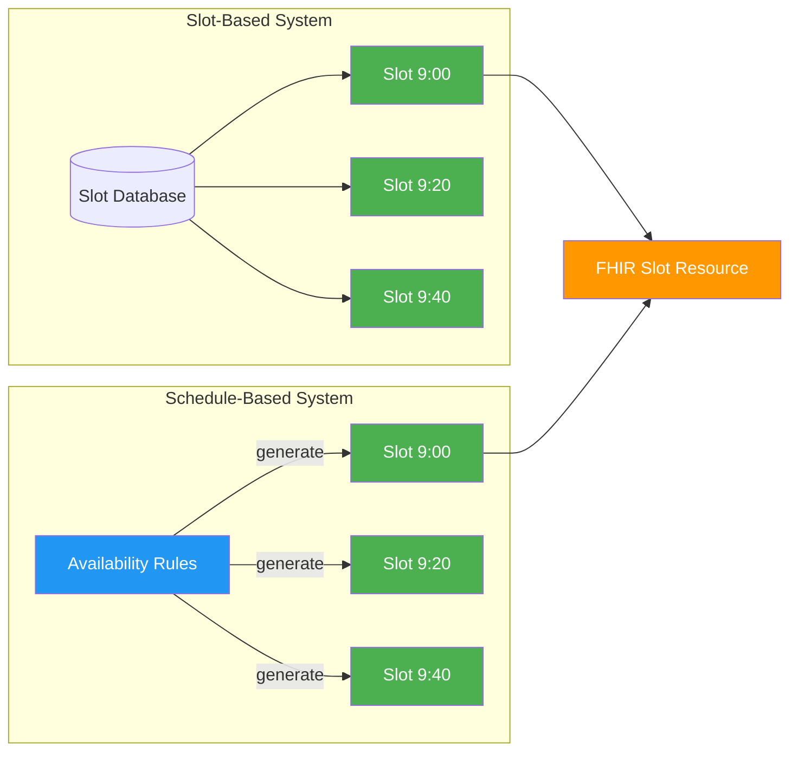
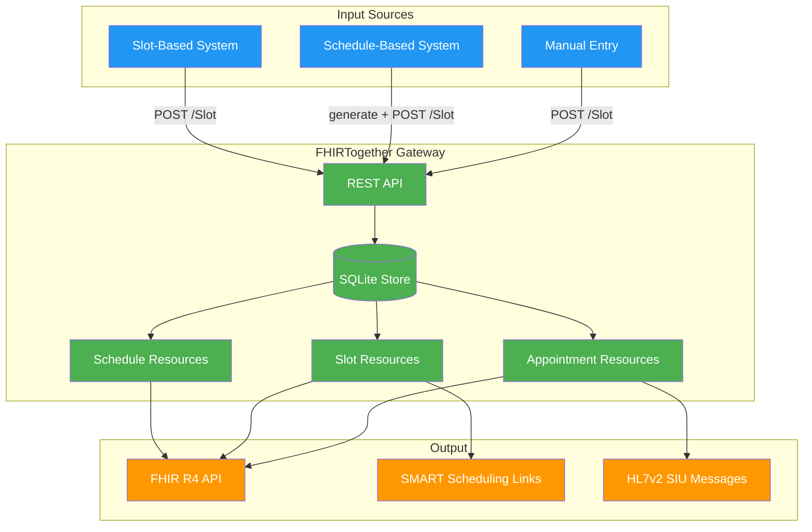
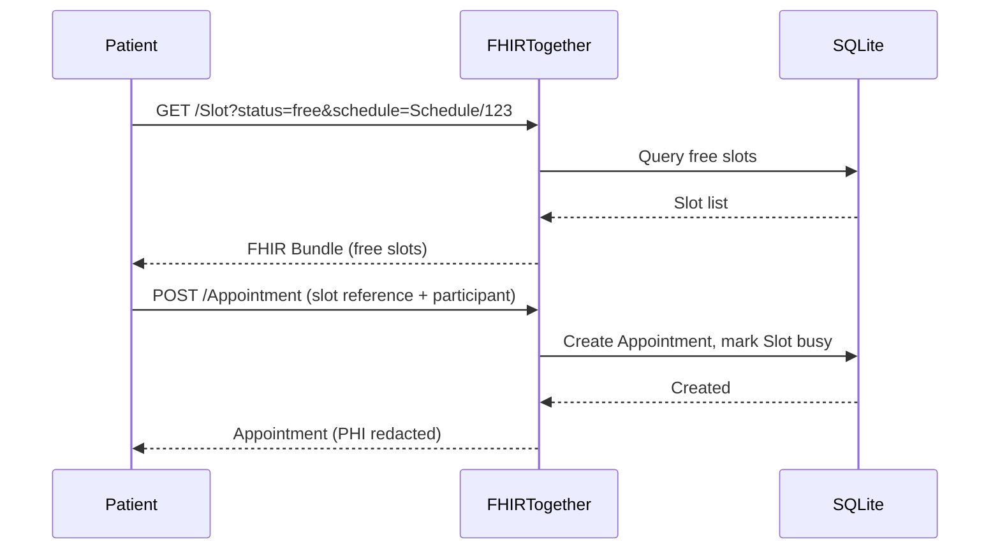
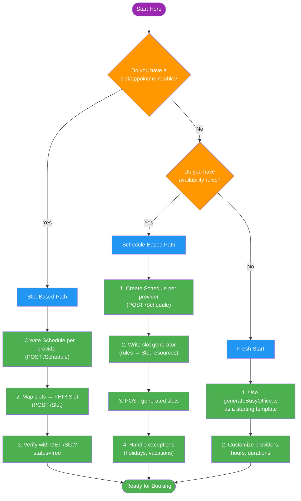

# Scheduling Models: Schedule vs Slot

> **TL;DR** — Legacy systems model availability in two fundamentally different ways.
> FHIRTogether accepts both and normalizes them into FHIR `Slot` resources
> ready for booking and SMART Scheduling Links compliance.

---

## 1. Overview: Two Scheduling Models

Healthcare scheduling systems fall into two camps:

| | **Slot-Based** | **Schedule-Based** |
|---|---|---|
| **Philosophy** | Concrete, precomputed availability | Rules that *describe* availability |
| **Data shape** | A row per bookable time block | Recurrence rules, durations, exceptions |
| **Generation** | Slots exist before anyone asks | Slots are derived on demand |
| **Example** | "Dr. Smith has a 9:00 AM slot on Monday" | "Dr. Smith sees patients Mon–Fri, 8–5, every 20 min" |

Both are valid. Both are common. The difference matters when you integrate.



---

## 2. Identify Your System Type

### ✅ You have a **Slot-Based** system if:

- [ ] Your database has a table of time slots with start/end times
- [ ] Availability is precomputed (nightly batch, admin UI, etc.)
- [ ] Booking means claiming an existing row
- [ ] You can export a list of "open appointments"

**Examples:** Many EHR appointment books, clinic scheduling modules, OpenMRS

### ✅ You have a **Schedule-Based** system if:

- [ ] Providers define working hours and appointment durations
- [ ] Available times are calculated from rules, not stored
- [ ] You use concepts like "recurrence," "templates," or "block schedules"
- [ ] There's no explicit slot table — availability is derived

**Examples:** Google Calendar-style systems, rule-engine schedulers, some enterprise EHRs

### ✅ You have a **Hybrid** system if:

- [ ] Rules generate slots, but slots are then persisted
- [ ] Some availability is manual, some is rule-driven

> **FHIRTogether itself is a hybrid** — it stores concrete Slot resources
> but can accept them from either upstream model.

---

## 3. Integration Path: Slot-Based Systems

> *"If you already have slots, you're 80% done."*

### Step 1: Map your slots to FHIR

Your existing slot data maps directly to a FHIR `Slot` resource:

```json
{
  "resourceType": "Slot",
  "schedule": { "reference": "Schedule/dr-smith-family-med" },
  "status": "free",
  "start": "2026-05-01T09:00:00Z",
  "end": "2026-05-01T09:20:00Z",
  "serviceType": [{ "text": "Family Medicine" }]
}
```

| Your field | FHIR Slot field | Notes |
|---|---|---|
| Provider ID | `schedule.reference` | Create a Schedule per provider first |
| Start time | `start` | ISO 8601 datetime |
| End time | `end` | ISO 8601 datetime |
| Available? | `status` | `free`, `busy`, `busy-unavailable`, `busy-tentative` |
| Appointment type | `serviceType` | CodeableConcept array |

### Step 2: Create a Schedule for each provider

Every Slot must reference a Schedule. Create one per provider:

```json
{
  "resourceType": "Schedule",
  "actor": [
    {
      "reference": "Practitioner/practitioner-smith",
      "display": "Dr. Sarah Smith"
    }
  ],
  "serviceType": [{ "text": "Family Medicine" }],
  "planningHorizon": {
    "start": "2026-05-01",
    "end": "2026-10-28"
  },
  "comment": "Schedule for Dr. Sarah Smith"
}
```

### Step 3: Push to FHIRTogether

```bash
# Create the schedule
curl -X POST http://localhost:4010/Schedule \
  -H "Content-Type: application/json" \
  -d @schedule.json

# Create slots (one per available time)
curl -X POST http://localhost:4010/Slot \
  -H "Content-Type: application/json" \
  -d @slot.json
```

### Step 4: Verify

```bash
# List free slots for a schedule
curl "http://localhost:4010/Slot?schedule=Schedule/dr-smith-family-med&status=free"
```

Response is a FHIR Bundle:

```json
{
  "resourceType": "Bundle",
  "type": "searchset",
  "total": 42,
  "entry": [
    {
      "resource": {
        "resourceType": "Slot",
        "id": "slot-001",
        "schedule": { "reference": "Schedule/dr-smith-family-med" },
        "status": "free",
        "start": "2026-05-01T09:00:00.000Z",
        "end": "2026-05-01T09:20:00.000Z"
      }
    }
  ]
}
```

**That's it.** Your slots are now FHIR-compliant and bookable.

---

## 4. Integration Path: Schedule-Based Systems

> *"You don't need to precompute slots — FHIRTogether does it for you."*

If your system defines availability as rules rather than concrete slots,
you need to **generate slots** from those rules before pushing to FHIRTogether.

### Step 1: Create a FHIR Schedule for the provider

```bash
curl -X POST http://localhost:4010/Schedule \
  -H "Content-Type: application/json" \
  -d '{
    "resourceType": "Schedule",
    "actor": [{ "reference": "Practitioner/practitioner-williams", "display": "Dr. Amy Williams" }],
    "serviceType": [{ "text": "Pediatrics" }],
    "planningHorizon": { "start": "2026-05-01", "end": "2026-10-28" },
    "comment": "Pediatrics — Mon-Fri 8am-4pm, 15 min slots"
  }'
```

### Step 2: Define availability with the Schedule YAML format

FHIRTogether uses a simple YAML format to describe recurring availability.
This is the **same format** used by the HL7 Tester's slot builder, the
`generateBusyOffice.ts` data generator, and the planned YAML import API.

#### Minimal example

```yaml
# Schedule definition for Dr. Amy Williams
# Schedule: Schedule/<id-from-step-1>

startDate: "2026-05-01"
endDate:   "2026-10-28"
weekdays:  [mon, tue, wed, thu, fri]

blocks:
  - start: "08:00"
    end:   "12:00"
    duration: 15    # minutes per slot
  - start: "13:00"
    end:   "16:00"
    duration: 15
```

#### Full example with appointment types and overbooking

```yaml
startDate: "2026-05-01"
endDate:   "2026-10-28"
weekdays:  [mon, tue, wed, thu, fri]

# Define appointment types (maps to WebChart apt_types table)
appointmentTypes:
  - code: OV
    description: "Office Visit"
    duration: 30
  - code: FU
    description: "Follow-Up"
    duration: 15
  - code: NP
    description: "New Patient"
    duration: 45

blocks:
  - start: "08:00"
    end:   "12:00"
    duration: 30
    types: [OV, FU, NP]    # allowed appointment types for this block
    overbook: 2             # max concurrent overbookings
  - start: "13:00"
    end:   "16:00"
    duration: 15
    types: [FU]             # afternoon = follow-ups only
    overbook: 0             # no overbooking
```

#### RRULE example: bi-weekly clinic

For schedules that don't follow a simple weekly pattern, use an
[RFC 5545 RRULE](https://datatracker.ietf.org/doc/html/rfc5545#section-3.3.10)
string instead of `weekdays`. The `rrule` field takes precedence over `weekdays`.

```yaml
startDate: "2026-05-01"
endDate:   "2026-10-28"
rrule: "FREQ=WEEKLY;INTERVAL=2;BYDAY=MO,WE,FR"   # every other week
exdates: [2026-07-04, 2026-09-07]                  # skip holidays

blocks:
  - start: "08:00"
    end:   "12:00"
    duration: 30
```

Common RRULE patterns:

| Pattern | RRULE | Notes |
|---|---|---|
| Every weekday | `FREQ=WEEKLY;BYDAY=MO,TU,WE,TH,FR` | Same as `weekdays: [mon–fri]` |
| Bi-weekly Mon/Wed/Fri | `FREQ=WEEKLY;INTERVAL=2;BYDAY=MO,WE,FR` | Alternating weeks |
| First Monday of month | `FREQ=MONTHLY;BYDAY=1MO` | Monthly specialist clinic |
| Last Friday of month | `FREQ=MONTHLY;BYDAY=-1FR` | End-of-month reviews |
| Every 3rd day | `FREQ=DAILY;INTERVAL=3` | Rotating coverage |

#### Field reference

| YAML field | Purpose | FHIR Slot field | Example |
|---|---|---|---|
| `startDate` | First day of the availability window | — (controls generation range) | `"2026-05-01"` |
| `endDate` | Last day of the availability window | — (controls generation range) | `"2026-10-28"` |
| `weekdays` | Which days to generate slots | — (controls generation range) | `[mon, wed, fri]` |
| `rrule` | RFC 5545 recurrence rule (overrides weekdays) | — (controls generation range) | `"FREQ=WEEKLY;INTERVAL=2;BYDAY=MO"` |
| `exdates` | Dates to exclude (holidays, closures) | — (controls generation range) | `[2026-07-04, 2026-12-25]` |
| `appointmentTypes[].code` | Short identifier for visit type | — (lookup key) | `OV` |
| `appointmentTypes[].description` | Display name | `appointmentType.text` | `"Office Visit"` |
| `appointmentTypes[].duration` | Default minutes for this type | — (can override block duration) | `30` |
| `blocks[].start` | Block start time (24h) | — (generates `start`) | `"08:00"` |
| `blocks[].end` | Block end time (24h) | — (generates `end`) | `"12:00"` |
| `blocks[].duration` | Slot length in minutes | `end` - `start` per slot | `15` |
| `blocks[].types` | Allowed appointment types | `appointmentType`, `serviceType[]` | `[OV, FU]` |
| `blocks[].overbook` | Max concurrent overbookings | `overbooked`, `comment` | `2` |

Multiple blocks model lunch breaks and split shifts naturally —
the gap between 12:00 and 13:00 above is the lunch hour.

### Step 3: Generate slots from the YAML

The YAML expands into individual FHIR Slot resources. You can use:

- **HL7 Tester UI** → Send an SIU message, then click **Generate Slots** and
  paste your YAML. The browser creates slots via `POST /Slot` directly.
- **Programmatically** — the expansion logic is straightforward:

```typescript
// Same algorithm used by hl7-tester.html and generateBusyOffice.ts
for (let day = startDate; day <= endDate; day = nextDay(day)) {
  if (!weekdays.includes(day.getDay())) continue;

  for (const block of blocks) {
    let current = setTime(day, block.start);
    const blockEnd = setTime(day, block.end);

    while (current + block.duration <= blockEnd) {
      await POST('/Slot', {
        resourceType: 'Slot',
        schedule: { reference: `Schedule/${scheduleId}` },
        status: 'free',
        start: current.toISOString(),
        end: addMinutes(current, block.duration).toISOString(),
      });
      current = addMinutes(current, block.duration);
    }
  }
}
```

### Step 4: Handle exceptions

Real schedules have exceptions (holidays, vacations).
Mark those slots as unavailable:

```json
{
  "resourceType": "Slot",
  "schedule": { "reference": "Schedule/dr-williams-peds" },
  "status": "busy-unavailable",
  "start": "2026-07-04T08:00:00Z",
  "end": "2026-07-04T16:00:00Z",
  "comment": "Holiday — Independence Day"
}
```

### Mapping from WebChart and other legacy EHRs

Enterprise EHRs like WebChart express availability through schedule templates,
appointment types, recurrence rules, and overbooking settings. Here's how each
concept maps to the Schedule YAML and FHIR resources.

#### Schedule template → YAML blocks

WebChart's `schedules` table defines availability as time blocks with recurrence:

| WebChart `schedules` column | Schedule YAML | Notes |
|---|---|---|
| `startdate` / `enddate` (time portion) | `blocks[].start` / `blocks[].end` | Working hours for the block |
| `startdate` / `rc_enddate` (date portion) | `startDate` / `endDate` | Date range for the availability window |
| `rc_dow` (day-of-week bitmask) | `weekdays: [mon, wed, fri]` | Mon=2, Tue=4, Wed=8, etc. → named days |
| `num_overbook` | `blocks[].overbook` | Max concurrent overbookings |
| `num_total_apts` | — | Enforce via slot count per block |
| `absorb` | — | Controls whether overbooking absorbs into adjacent slots |
| `portal_time_slots` | — | Controls patient portal visibility (future) |
| `recurrence` / `rc_interval` | Implicit in `startDate`→`endDate` + `weekdays` | YAML generates all days; recurrence is "expanded" |
| `location` | FHIR `Schedule.actor[]` with Location reference | Add a Location actor alongside the Practitioner |
| `color` | — | Display concern, not scheduling data |

#### Appointment types → `appointmentTypes`

WebChart's `apt_types` table maps directly:

| WebChart `apt_types` column | Schedule YAML | FHIR Slot field |
|---|---|---|
| `code` | `appointmentTypes[].code` | — (lookup key) |
| `description` | `appointmentTypes[].description` | `appointmentType.text` |
| `duration` | `appointmentTypes[].duration` | `end` - `start` |
| `pat_duration` | — | Patient-visible duration (future) |
| `portal_available` | — | Controls portal visibility (future) |
| `color` | — | Display concern |
| `enc_type` | — | Encounter creation, outside scheduling scope |

#### Per-schedule type restrictions → `blocks[].types`

WebChart's `multi_type_sched` junction table controls which appointment types
are allowed in each schedule block:

| WebChart `multi_type_sched` column | Schedule YAML |
|---|---|
| `type` (FK → `apt_types.code`) | `blocks[].types: [OV, FU]` |
| `required` | — (all listed types are available) |
| `portal_available` | — (future) |

#### Per-resource overrides → separate YAML files

WebChart's `apt_type_templates` table allows overriding durations per resource
and location. In FHIRTogether, each provider gets their own Schedule + YAML,
so resource-specific overrides are just different YAML files:

```yaml
# Dr. Williams — Pediatrics (shorter visits)
appointmentTypes:
  - code: OV
    description: "Office Visit"
    duration: 15          # 15 min for peds vs 30 min for family med
```

#### Recurrence expansion

WebChart uses `RC_TYPE` enums (daily, weekly, monthly, nth-weekday, etc.)
with `rc_interval`, `rc_dow` bitmask, and `rc_enddate`. The Schedule YAML
"expands" these into a flat date range + weekday list:

| WebChart recurrence | Schedule YAML equivalent |
|---|---|
| `RC_WEEKLY` + `rc_dow=42` (Mon+Wed+Fri) + `rc_interval=1` | `weekdays: [mon, wed, fri]` |
| `RC_WEEKLY` + `rc_dow=62` (Mon–Fri) + `rc_interval=2` | `rrule: "FREQ=WEEKLY;INTERVAL=2;BYDAY=MO,TU,WE,TH,FR"` |
| `RC_DAILY` + `rc_interval=1` | `weekdays: [mon, tue, wed, thu, fri, sat, sun]` |
| `RC_MONTHLY` + `rc_dow=2` (Mon) + nth-weekday | `rrule: "FREQ=MONTHLY;BYDAY=1MO"` |
| `rc_enddate` | `endDate` |

> **Note:** The `rrule` field supports any valid RFC 5545 recurrence rule,
> including bi-weekly, monthly, and nth-weekday patterns. The `weekdays`
> field remains available as a simpler alternative for basic weekly schedules.
> Use `exdates` to exclude specific dates (holidays, vacations) from any
> recurrence pattern.

---

## 5. Unified Model in FHIRTogether

Regardless of how availability enters the system, FHIRTogether normalizes
everything into three FHIR R4 resources:



### The three resources

| Resource | Purpose | Relationship |
|---|---|---|
| **Schedule** | Container for a provider's availability window | Has many Slots |
| **Slot** | A single bookable time block | Belongs to a Schedule; referenced by Appointments |
| **Appointment** | A committed booking | References one or more Slots; has Participants |

### How booking works



---

## 6. SMART Scheduling Links Compatibility

[SMART Scheduling Links](https://build.fhir.org/ig/HL7/smart-scheduling-links/)
is the emerging standard for publishing vaccine and appointment availability.
It expects **Slot resources only** — no proprietary availability formats.

### What SMART Scheduling Links requires

1. **Location** — where appointments happen
2. **Schedule** — who/what is available
3. **Slot** — concrete bookable times with status
4. **`$bulk-publish`** — NDJSON manifest of the above

### How FHIRTogether bridges the gap

| If your system has… | FHIRTogether provides… |
|---|---|
| Precomputed slots | Direct FHIR Slot exposure |
| Availability rules | A pattern for generating compliant Slots |
| Neither | A complete scheduling backend with FHIR-native storage |

> **Future:** FHIRTogether plans to add a `$bulk-publish` endpoint that
> generates the NDJSON manifest automatically from stored Slots.
> Track progress in [GitHub Issues](https://github.com/mieweb/FHIRTogether/issues).

### Compliance checklist

- [x] Slot resources with `status`, `start`, `end`
- [x] Schedule resources with `actor` references
- [x] FHIR R4 Bundle responses for search
- [ ] `$bulk-publish` endpoint (planned)
- [ ] Location resources (planned)

---

## 7. Migration & Adoption Guidance

### Decision tree



### Quick-start paths

#### Path A: I have slots (5 minutes)

```bash
# 1. Start FHIRTogether
npm run dev

# 2. Create a schedule
curl -X POST http://localhost:4010/Schedule \
  -H "Content-Type: application/json" \
  -d '{"resourceType":"Schedule","actor":[{"reference":"Practitioner/dr-1","display":"Dr. Example"}],"planningHorizon":{"start":"2026-05-01","end":"2026-10-28"}}'

# 3. Push your slots (repeat for each slot)
curl -X POST http://localhost:4010/Slot \
  -H "Content-Type: application/json" \
  -d '{"resourceType":"Slot","schedule":{"reference":"Schedule/<id-from-step-2>"},"status":"free","start":"2026-05-01T09:00:00Z","end":"2026-05-01T09:20:00Z"}'

# 4. Book an appointment
curl -X POST http://localhost:4010/Appointment \
  -H "Content-Type: application/json" \
  -d '{"resourceType":"Appointment","status":"booked","slot":[{"reference":"Slot/<id-from-step-3>"}],"participant":[{"actor":{"reference":"Practitioner/dr-1"},"status":"accepted"},{"actor":{"reference":"Patient/patient-1"},"status":"accepted"}]}'
```

#### Path B: I have rules (5 minutes with HL7 Tester)

1. Start FHIRTogether: `npm run dev`
2. Open the HL7 Tester: `http://localhost:4010/hl7-tester.html`
3. Send an SIU^S12 message to register a provider
4. Click **Generate Slots** and edit the YAML to match your provider's hours:
   ```yaml
   startDate: "2026-05-01"
   endDate:   "2026-10-28"
   weekdays:  [mon, tue, wed, thu, fri]

   appointmentTypes:
     - code: OV
       description: "Office Visit"
       duration: 30

   blocks:
     - start: "08:00"
       end:   "12:00"
       duration: 30
       types: [OV]
     - start: "13:00"
       end:   "16:00"
       duration: 30
       types: [OV]
   ```
5. Click **Create Slots** — done!

For programmatic generation, see `src/examples/generateBusyOffice.ts`
which uses the same block/duration/weekday model.

#### Path C: Starting fresh (2 minutes)

```bash
npm install
npm run generate-data   # Creates 3 providers, 180 days of slots, 75% booked
npm run dev             # API ready at http://localhost:4010
open http://localhost:4010/docs  # Swagger UI
```

---

## Further Reading

- [QUICKSTART.md](../QUICKSTART.md) — Setup and first run
- [ARCHITECTURE.md](../ARCHITECTURE.md) — System design and ER diagram
- [IMPLEMENTATION.md](../IMPLEMENTATION.md) — Endpoint reference
- [src/examples/README.md](../src/examples/README.md) — Data generation guide
- [FHIR R4 Slot](https://hl7.org/fhir/R4/slot.html) — Official specification
- [FHIR R4 Schedule](https://hl7.org/fhir/R4/schedule.html) — Official specification
- [SMART Scheduling Links](https://build.fhir.org/ig/HL7/smart-scheduling-links/) — Availability publishing standard
