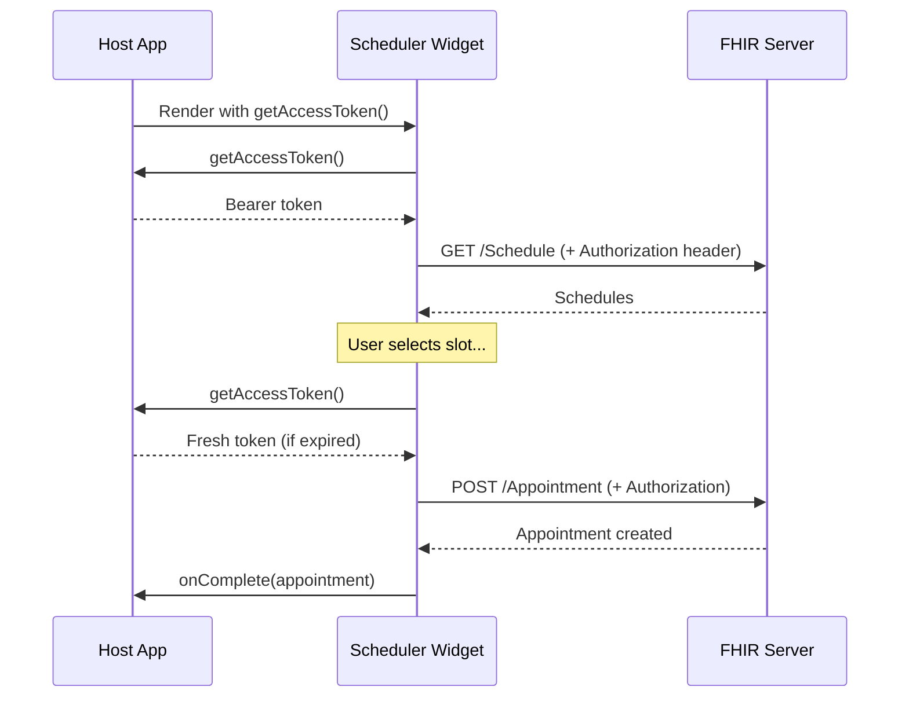
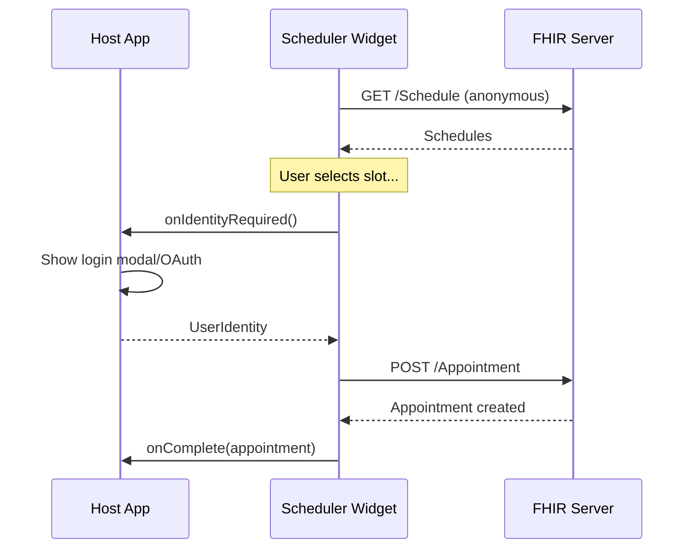
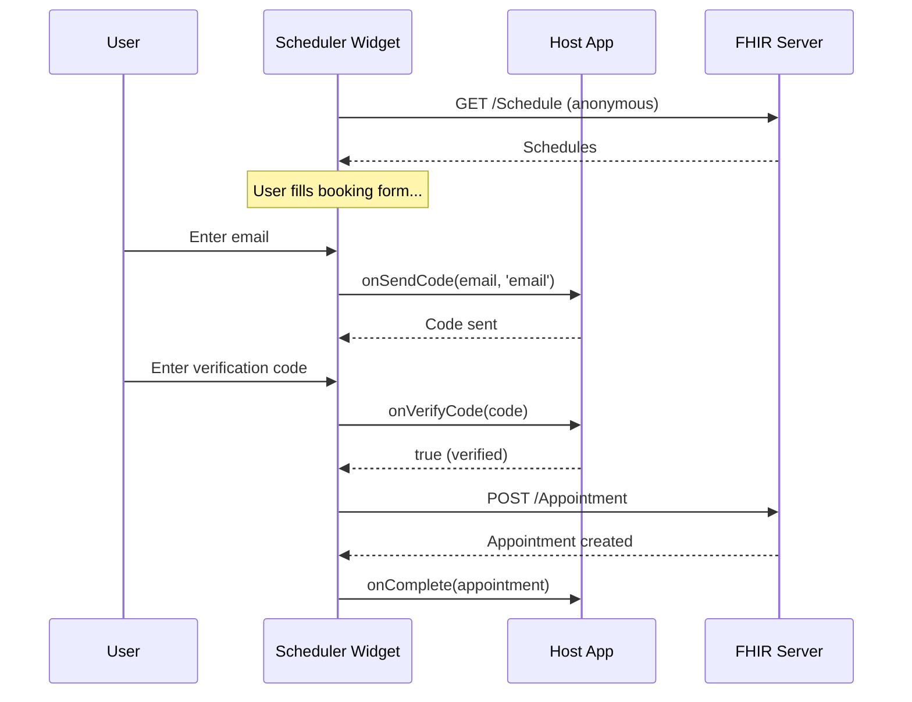

# Authentication & Identity Management

**`@mieweb/fhir-scheduler`** — Authentication patterns for the embeddable scheduling widget.

---

## 🎯 Design Philosophy

The scheduler widget **delegates authentication to the host application**. It never stores tokens, manages sessions, or owns login UI. This keeps the widget:

- **Framework-agnostic** — Works with any auth library
- **Secure** — No token storage in the widget
- **Flexible** — Host decides the auth UX

| Concern | Who Owns It |
|---------|-------------|
| Authentication | Host application |
| Token storage | Host application |
| Login UI | Host application |
| API authorization | Widget (attaches token to requests) |
| Booking flow | Widget |

---

## 🔐 Auth Modes

The widget supports four authentication modes via the `authMode` prop:

| Mode | Use Case |
|------|----------|
| `anonymous` | Public booking pages, no login required |
| `token` | Host provides access token (static or refreshable) |
| `callback` | Host controls identity flow via callback |
| `smart` | SMART on FHIR launch for EHR integrations |

---

## 📋 Auth Props / Attributes

### React Component

```tsx
interface SchedulerAuthProps {
  // Auth mode (default: 'anonymous')
  authMode?: 'anonymous' | 'token' | 'callback' | 'smart';
  
  // For 'token' mode
  accessToken?: string;
  getAccessToken?: () => Promise<string>;
  
  // For 'anonymous' mode - verification config
  verification?: {
    required: boolean;
    methods: ('email' | 'sms' | 'captcha')[];
    onSendCode?: (contact: string, method: string) => Promise<void>;
    onVerifyCode?: (code: string) => Promise<boolean>;
  };
  
  // For 'callback' mode
  onIdentityRequired?: () => Promise<UserIdentity>;
  
  // For 'smart' mode
  smartConfig?: {
    clientId: string;
    scope: string;
    redirectUri?: string;
  };
  
  // Pre-populated user info (any mode)
  user?: UserIdentity;
}

interface UserIdentity {
  identifier: string;        // Unique ID (email, patient ID, etc.)
  display: string;           // Name to show
  email?: string;
  phone?: string;
  verified: boolean;
  fhirPatientId?: string;    // Link to existing FHIR Patient
}
```

### Web Component Attributes

| Attribute | Type | Description |
|-----------|------|-------------|
| `auth-mode` | string | `anonymous`, `token`, `callback`, or `smart` |
| `access-token` | string | Static bearer token |

Properties set via JavaScript:
- `getAccessToken` — Async token refresh function
- `verification` — Verification config object
- `onIdentityRequired` — Identity callback function
- `smartConfig` — SMART on FHIR config object
- `user` — Pre-populated user identity

---

## 🚀 Usage Examples

### Mode 1: Anonymous (Default)

No authentication required. Patient provides info during booking.

```tsx
// React
<SchedulerWidget
  fhirBaseUrl="https://api.example.com/fhir"
  authMode="anonymous"
/>
```

```html
<!-- Web Component -->
<fhir-scheduler
  fhir-base-url="https://api.example.com/fhir"
  auth-mode="anonymous"
></fhir-scheduler>
```

### Mode 2: Token Injection

Host provides access token for authenticated API requests.

```tsx
// React - Static token
<SchedulerWidget
  fhirBaseUrl="https://api.example.com/fhir"
  authMode="token"
  accessToken={session.accessToken}
/>

// React - Refreshable token
<SchedulerWidget
  fhirBaseUrl="https://api.example.com/fhir"
  authMode="token"
  getAccessToken={() => authService.getValidToken()}
/>
```

```html
<!-- Web Component -->
<fhir-scheduler
  fhir-base-url="https://api.example.com/fhir"
  auth-mode="token"
></fhir-scheduler>

<script>
  const scheduler = document.querySelector('fhir-scheduler');
  
  // Option A: Static token
  scheduler.accessToken = myAuthService.getToken();
  
  // Option B: Token refresh (called before each API request)
  scheduler.getAccessToken = async () => {
    return await myAuthService.getValidToken();
  };
</script>
```

### Mode 3: Identity Callback

Host controls the login/identity flow.

```tsx
// React
<SchedulerWidget
  fhirBaseUrl="https://api.example.com/fhir"
  authMode="callback"
  onIdentityRequired={async () => {
    // Show login modal, OAuth popup, redirect, etc.
    const user = await showLoginModal();
    return {
      identifier: user.email,
      display: user.name,
      email: user.email,
      verified: true
    };
  }}
/>
```

```html
<!-- Web Component -->
<fhir-scheduler
  fhir-base-url="https://api.example.com/fhir"
  auth-mode="callback"
></fhir-scheduler>

<script>
  const scheduler = document.querySelector('fhir-scheduler');
  
  scheduler.onIdentityRequired = async () => {
    const user = await myApp.ensureLoggedIn();
    return {
      identifier: user.id,
      display: user.name,
      email: user.email,
      verified: true,
      fhirPatientId: user.patientId
    };
  };
</script>
```

### Mode 4: Anonymous + Verification

Require email/SMS verification for anonymous bookings.

```tsx
// React
<SchedulerWidget
  fhirBaseUrl="https://api.example.com/fhir"
  authMode="anonymous"
  verification={{
    required: true,
    methods: ['email', 'sms'],
    onSendCode: async (contact, method) => {
      await api.sendVerificationCode(contact, method);
    },
    onVerifyCode: async (code) => {
      return await api.verifyCode(code);
    }
  }}
/>
```

### Mode 5: Pre-populated User

Skip patient info if user is already known.

```tsx
// React
<SchedulerWidget
  fhirBaseUrl="https://api.example.com/fhir"
  authMode="token"
  accessToken={session.accessToken}
  user={{
    identifier: session.user.id,
    display: session.user.name,
    email: session.user.email,
    phone: session.user.phone,
    verified: true,
    fhirPatientId: session.user.patientId
  }}
/>
```

### Mode 6: SMART on FHIR (Healthcare)

For EHR integrations using SMART on FHIR authorization.

```tsx
// React
<SchedulerWidget
  fhirBaseUrl="https://ehr.example.com/fhir"
  authMode="smart"
  smartConfig={{
    clientId: 'my-scheduling-app',
    scope: 'patient/Appointment.write patient/Slot.read',
    redirectUri: window.location.href
  }}
/>
```

---

## 🖼️ Framework Examples

### Vue 3

```vue
<template>
  <fhir-scheduler
    fhir-base-url="https://api.example.com/fhir"
    :auth-mode="authMode"
    ref="schedulerRef"
    @complete="handleComplete"
  />
</template>

<script setup>
import { ref, computed, onMounted } from 'vue';
import '@mieweb/fhir-scheduler/standalone';
import { useAuth } from './composables/auth';

const schedulerRef = ref(null);
const { user, getToken, isLoggedIn } = useAuth();

const authMode = computed(() => isLoggedIn.value ? 'token' : 'anonymous');

onMounted(() => {
  const scheduler = schedulerRef.value;
  
  if (isLoggedIn.value) {
    scheduler.getAccessToken = getToken;
    scheduler.user = {
      display: user.value.name,
      email: user.value.email,
      verified: true
    };
  }
});

const handleComplete = (e) => {
  console.log('Booked:', e.detail);
};
</script>
```

### Plain JavaScript

```html
<fhir-scheduler
  fhir-base-url="https://api.example.com/fhir"
  auth-mode="callback"
></fhir-scheduler>

<script type="module">
  import '@mieweb/fhir-scheduler/standalone';

  const scheduler = document.querySelector('fhir-scheduler');
  
  // Check if user is already logged in
  const currentUser = MyAuthLib.getCurrentUser();
  
  if (currentUser) {
    scheduler.authMode = 'token';
    scheduler.getAccessToken = () => MyAuthLib.getValidToken();
    scheduler.user = {
      display: currentUser.name,
      email: currentUser.email,
      verified: true
    };
  } else {
    // Prompt login when identity is needed
    scheduler.onIdentityRequired = async () => {
      await MyAuthLib.showLoginModal();
      const user = MyAuthLib.getCurrentUser();
      return {
        identifier: user.email,
        display: user.name,
        verified: true
      };
    };
  }
  
  scheduler.addEventListener('complete', (e) => {
    console.log('Appointment booked:', e.detail);
  });
</script>
```

### Angular

```typescript
// scheduler.component.ts
import { Component, ElementRef, ViewChild, AfterViewInit } from '@angular/core';
import { AuthService } from './auth.service';

@Component({
  selector: 'app-scheduler',
  template: `
    <fhir-scheduler
      #scheduler
      fhir-base-url="https://api.example.com/fhir"
      (complete)="onComplete($event)"
    ></fhir-scheduler>
  `
})
export class SchedulerComponent implements AfterViewInit {
  @ViewChild('scheduler') schedulerRef!: ElementRef;
  
  constructor(private auth: AuthService) {}
  
  ngAfterViewInit() {
    const scheduler = this.schedulerRef.nativeElement;
    
    if (this.auth.isLoggedIn()) {
      scheduler.authMode = 'token';
      scheduler.getAccessToken = () => this.auth.getToken();
      scheduler.user = {
        display: this.auth.user.name,
        email: this.auth.user.email,
        verified: true
      };
    }
  }
  
  onComplete(event: CustomEvent) {
    console.log('Booked:', event.detail);
  }
}
```

---

## 🔄 Auth Flow Diagrams

### Token Mode Flow



### Callback Mode Flow



### Anonymous + Verification Flow



---

## 🔒 Security Considerations

### Token Handling
- Tokens are **never stored** by the widget
- `getAccessToken()` is called fresh before each API request
- Widget adds `Authorization: Bearer <token>` header automatically

### CORS
- FHIR server must allow CORS from the embedding domain
- Consider using a backend proxy for sensitive environments

### Verification Codes
- Host is responsible for rate limiting
- Host controls code generation and validation
- Widget only passes through the callbacks

### SMART on FHIR
- Uses standard SMART authorization flow
- Redirect-based (not popup) for mobile compatibility
- State parameter prevents CSRF attacks

---

## 📄 License

MIT — Part of the FHIRTogether project.
