# FHIR Scheduler Screenshots

This documentation is auto-generated by the screenshot tests.
Run `npx playwright test tests/screenshots.spec.ts` to regenerate.

## Booking Flow

### Visit Type Selection
Choose between follow-up or new patient visit

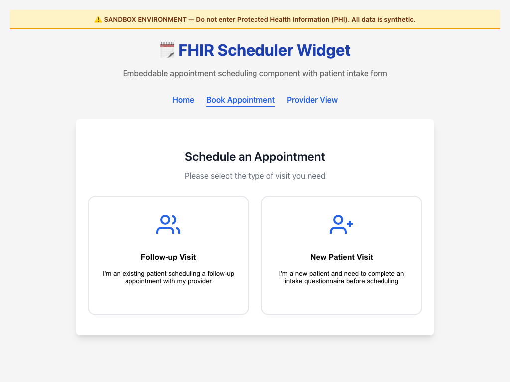

### New Patient Intake Questionnaire
Questionnaire for new patients before scheduling

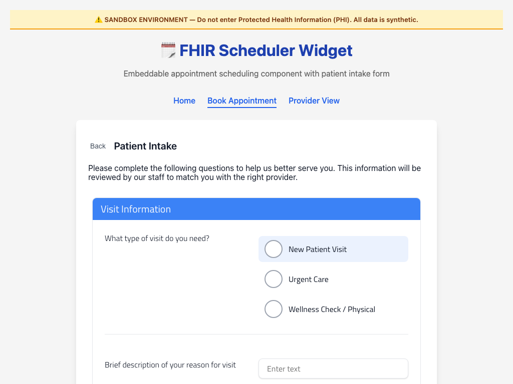

### Provider Selection
Browse and select from available providers

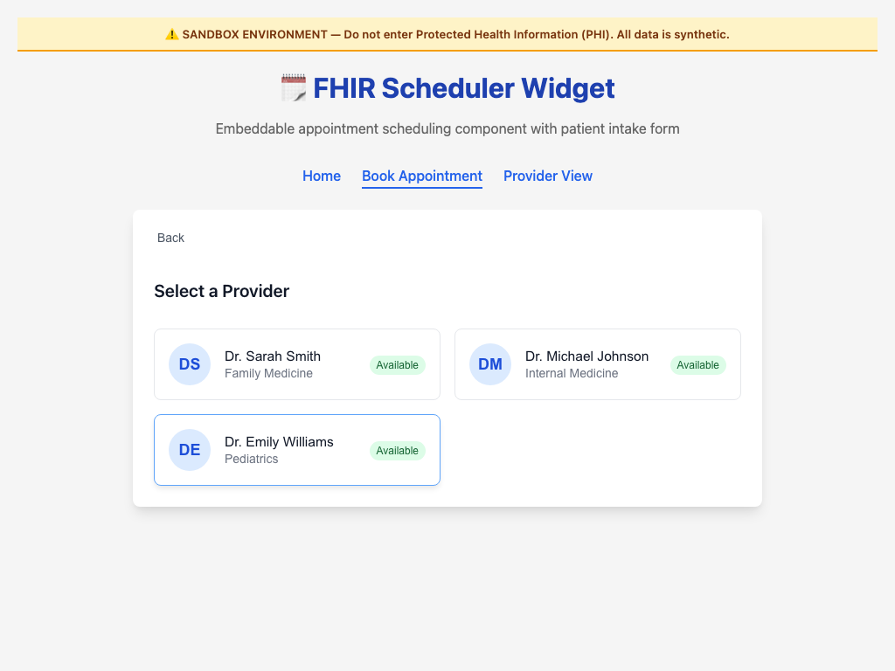

### Date Selection with Availability
View available dates with slot counts

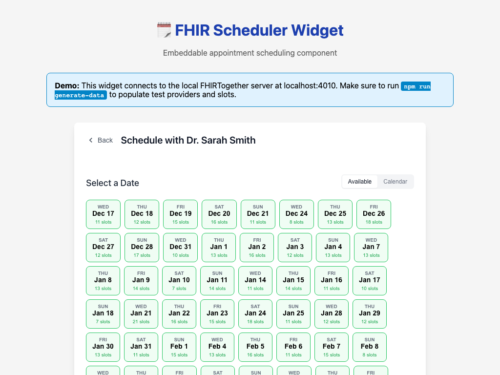

### Calendar View
Alternative calendar-based date picker

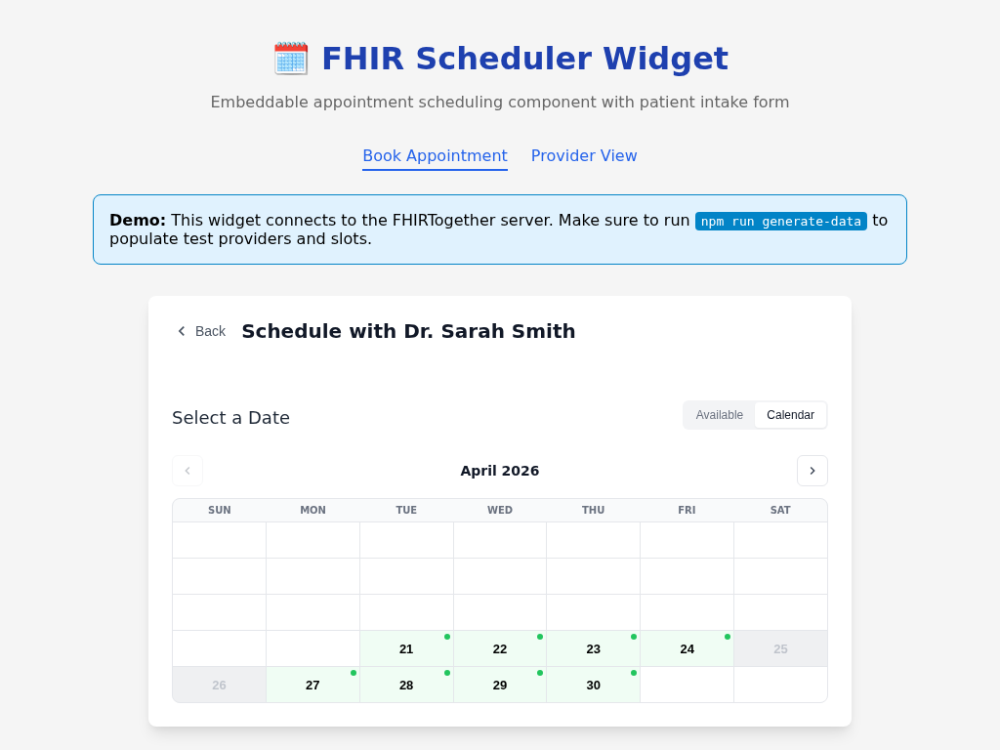

### Time Slot Selection
Choose from available appointment times

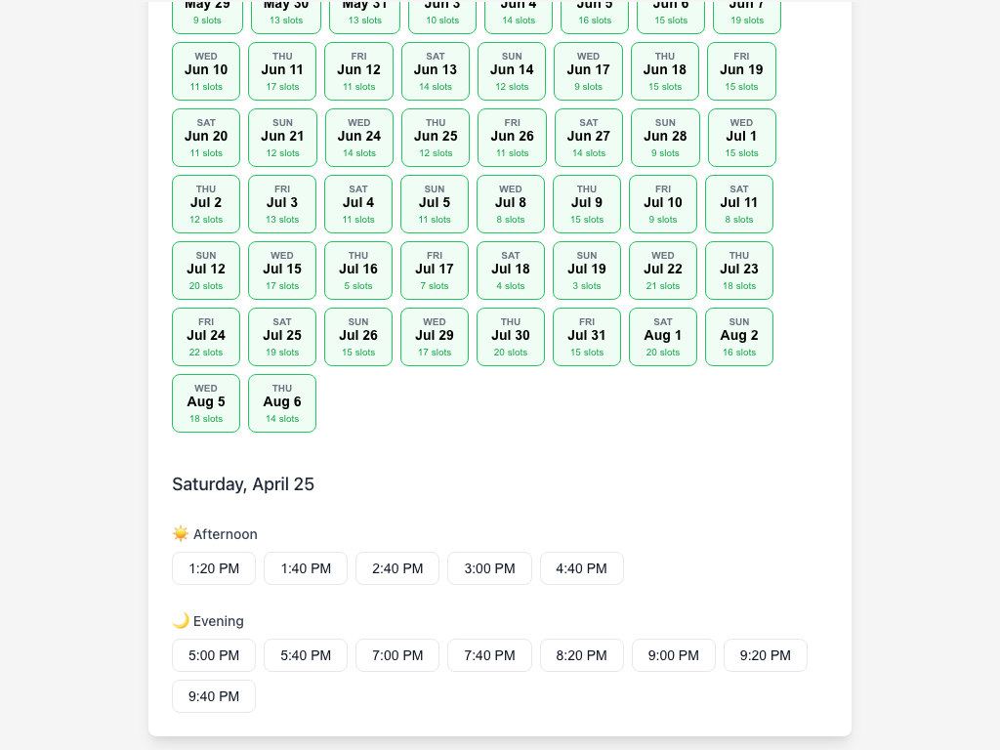

### Booking Form with Hold Timer
Complete booking with slot reservation countdown

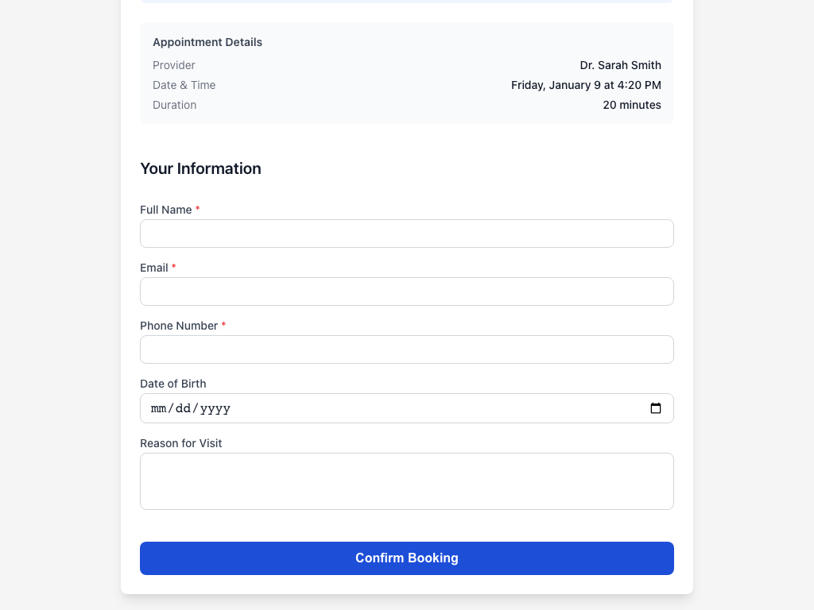

### Completed Form
Booking form with patient information entered

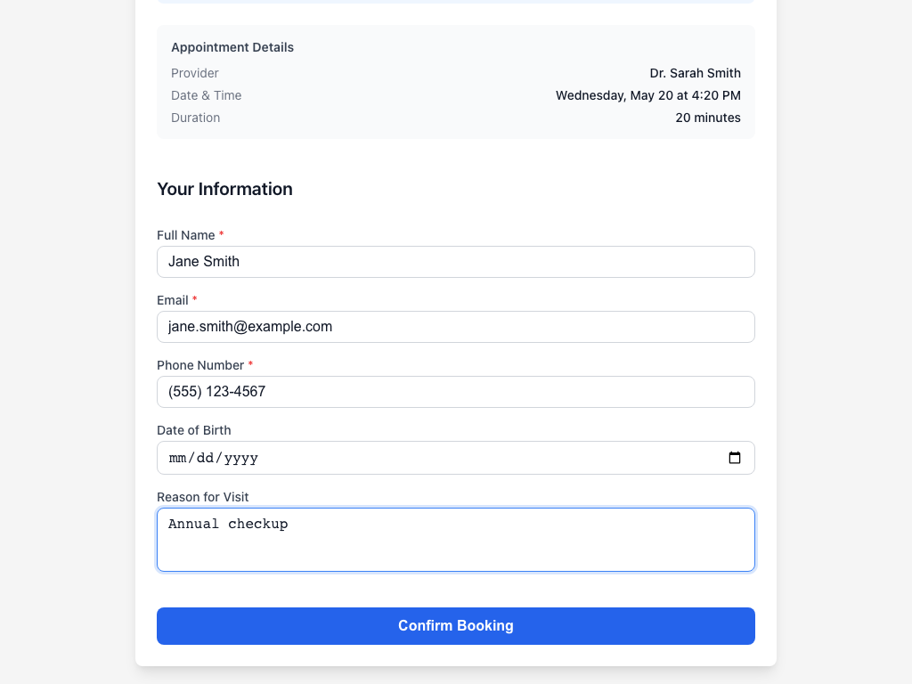

### Confirmation
Appointment successfully booked

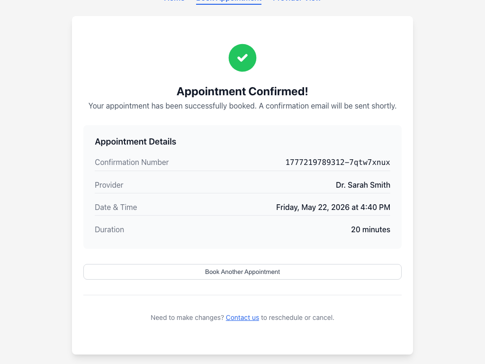

## Mobile Responsive

| Mobile Provider List | Mobile Booking Form |
|---|---|
| 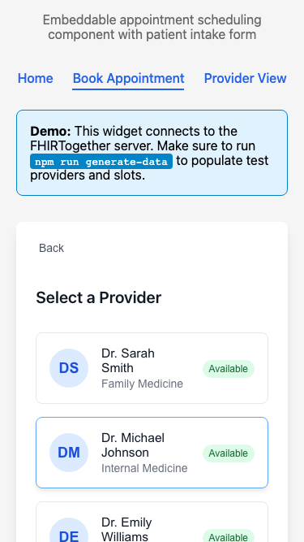 | 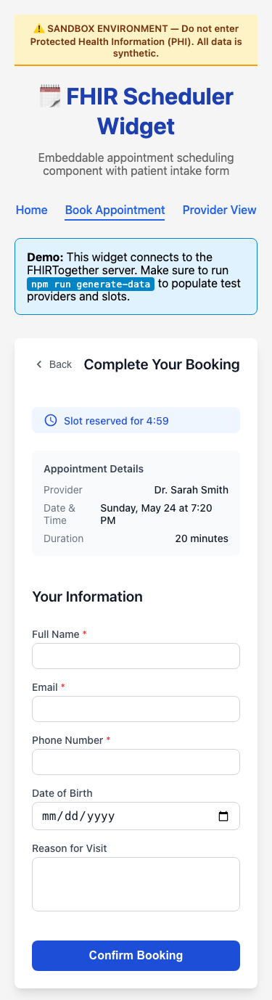 |
