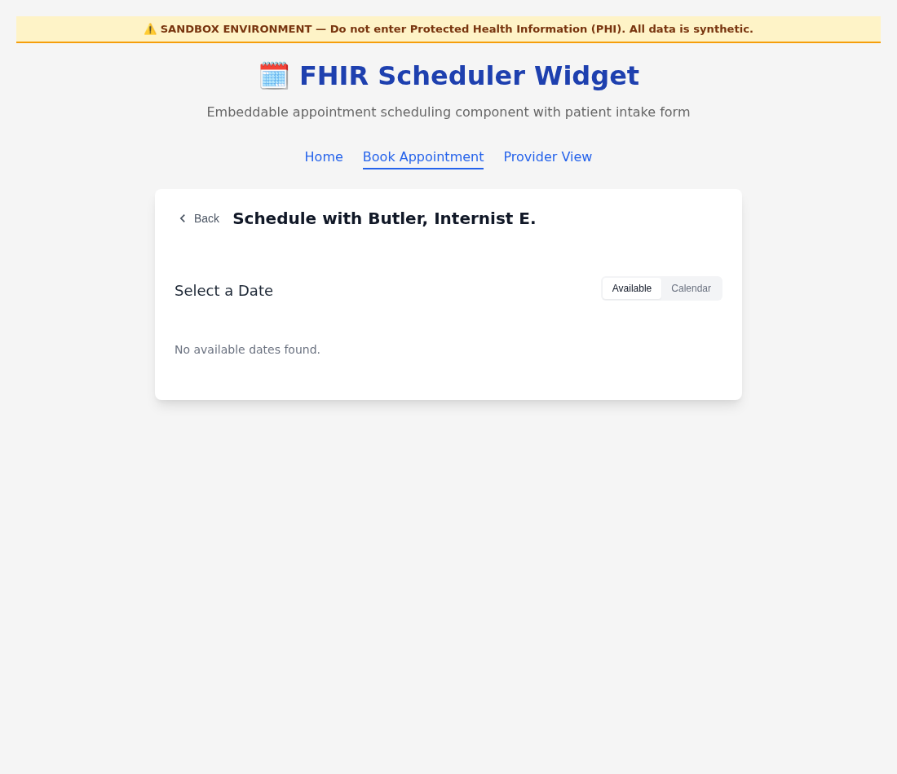
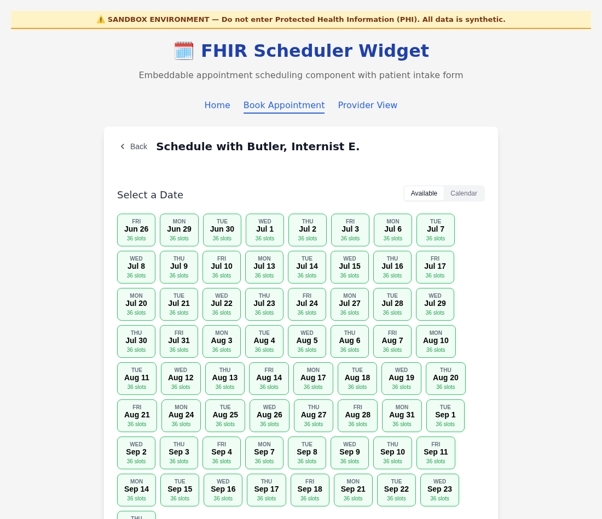
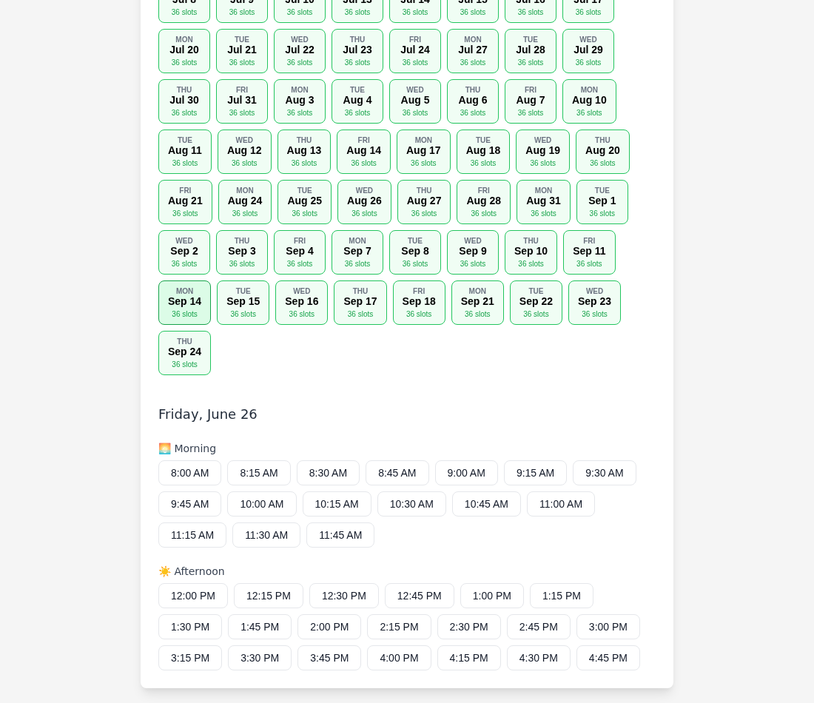

# Schedule Sync — Bookable Slots (Before / After)

Visual record for the change that makes **synced schedules generate bookable
slots**, and fixes the date-offset bug that hid available times.

See also: [scheduleSync](../../../src/scheduling/scheduleSync.ts) ·
[slotExpander](../../../src/scheduling/slotExpander.ts) ·
[booking calendar](../src/components/SlotCalendar.tsx)

## Before → After

| Before | After |
|---|---|
|  |  |
| A synced schedule persisted the provider but generated **no Slots**, so the booking calendar showed _"No available dates found."_ | Sync now expands the provider's `availableTime` into bookable `Slot`s, so every working day shows its open slot count. |

### Selecting a date now shows times

Previously, even when dates appeared, selecting one returned _"No available
times for this date"_ because `Slot` queries subtracted the demo date-offset
from the query window. The offset has been removed from `Slot` queries (it is
applied once at seed-import time), so per-day queries match the stored slots.

## Screenshot metadata

| Field | Value |
|---|---|
| Feature / screen | Booking calendar (`<fhir-scheduler>` widget) |
| Source route | `/scheduler/index.html#calendar/5` (Butler, Internist E.) |
| Viewport | 1100 × 950, desktop (Chromium) |
| Capture date | 2026-06-26 |
| Data | Synthetic sandbox data (synced from a WebChart `rest/schedules` feed) |

### How to reproduce

1. Sync a provider whose planning horizon extends into the future
   (`POST /sync-schedules` with the source feed `url`).
2. Open `/scheduler/index.html#calendar/<scheduleId>` and select the provider.
3. Available dates list working days with slot counts; selecting a date lists
   the open times.
