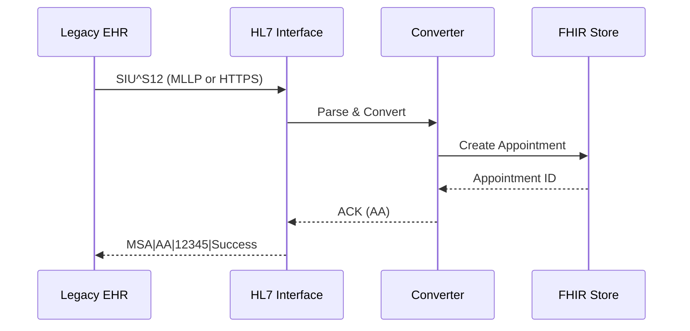

# HL7v2 Module

This module provides HL7v2 message ingestion support for FHIRTogether, enabling integration with legacy EHR systems that communicate via HL7v2 SIU (Scheduling Information Unsolicited) messages.

## Features

- **SIU Message Parsing**: Parse HL7v2 SIU messages (S12, S13, S14, S15, S17, S26)
- **FHIR Conversion**: Convert SIU messages to FHIR R4 Appointment, Slot, and Schedule resources
- **HTTPS Ingestion**: Receive HL7 messages via REST API endpoints
- **MLLP Socket**: TCP/TLS socket server supporting MLLP (Minimal Lower Layer Protocol)
- **ACK Responses**: Return proper HL7 ACK messages (AA, AE, AR)
- **Test Generator**: Generate realistic SIU messages for testing

## Supported Message Types

| Event | Description | FHIR Action |
|-------|-------------|-------------|
| SIU^S12 | New Appointment | Create Appointment |
| SIU^S13 | Appointment Reschedule | Update Appointment |
| SIU^S14 | Appointment Modification | Update Appointment |
| SIU^S15 | Appointment Cancellation | Cancel Appointment |
| SIU^S17 | Appointment Deletion | Cancel Appointment |
| SIU^S26 | Appointment No-Show | Mark as No-Show |

## Configuration

Add these environment variables to your `.env` file:

```bash
# HL7 Socket Server
HL7_SOCKET_ENABLED=true       # Enable/disable socket server (default: true)
HL7_SOCKET_PORT=2575          # MLLP socket port (default: 2575)

# TLS Configuration (optional)
HL7_TLS_ENABLED=false         # Enable TLS for socket
HL7_TLS_KEY=/path/to/key.pem  # Private key file
HL7_TLS_CERT=/path/to/cert.pem # Certificate file
HL7_TLS_CA=/path/to/ca.pem    # CA certificate (optional)
```

## API Endpoints

### POST /hl7/siu

Receive SIU scheduling messages via HTTPS.

**Request Body (JSON):**
```json
{
  "message": "MSH|^~\\&|LEGACY_EHR|MAIN_HOSPITAL|...",
  "wrapMLLP": false
}
```

**Request Body (Plain Text):**
```
MSH|^~\&|LEGACY_EHR|MAIN_HOSPITAL|FHIRTOGETHER|SCHEDULING_GATEWAY|20231209120000||SIU^S12|12345|P|2.3
SCH|10001^10001|10001^10001|||10001|OFFICE^Office visit|reason for the appointment|OFFICE|30|m|...
PID|1||42||DOE^JOHN||19800101|M|||123 Main St^^City^ST^12345||5551234567|||S||999999999
...
```

**Response:**
```json
{
  "ack": "MSH|^~\\&|FHIRTOGETHER|SCHEDULING_GATEWAY|LEGACY_EHR|MAIN_HOSPITAL|...\rMSA|AA|12345|Message processed successfully",
  "status": "success",
  "appointmentId": "apt-123",
  "action": "create"
}
```

### POST /hl7/raw

Receive raw HL7 messages with proper content-type headers.

**Headers:**
- `Content-Type: x-application/hl7-v2+er7` or `text/plain`

**Response:** Raw HL7 ACK message

### GET /hl7/status

Health check and status information.

**Response:**
```json
{
  "status": "healthy",
  "supportedMessages": ["SIU^S12", "SIU^S13", "SIU^S14", "SIU^S15", "SIU^S17", "SIU^S26"],
  "endpoints": {
    "https": "/hl7/siu",
    "raw": "/hl7/raw",
    "socket": "Port 2575"
  }
}
```

## MLLP Socket Protocol

The socket server uses MLLP (Minimal Lower Layer Protocol) framing:

- Start Block: `0x0B` (VT - Vertical Tab)
- End Block: `0x1C` (FS - File Separator)  
- Carriage Return: `0x0D` (CR)

Message format: `<VT>HL7 Message<FS><CR>`

### Example Socket Connection (Node.js)

```typescript
import { sendHL7OverSocket } from './src/hl7/client';

const result = await sendHL7OverSocket(hl7Message, {
  host: 'localhost',
  port: 2575,
  timeout: 30000,
});

console.log(result.ackCode); // 'AA', 'AE', or 'AR'
```

## Testing

### Generate Test Messages

```bash
# Run the HL7 test suite (requires server running)
npm run hl7-test

# Generate more messages
npm run hl7-test -- --count=50

# Test HTTPS only
npm run hl7-test -- --https-only

# Test socket only
npm run hl7-test -- --socket-only

# Verbose output
npm run hl7-test -- --verbose --count=5
```

### Sample SIU^S12 Message

```
MSH|^~\&|LEGACY_EHR|MAIN_HOSPITAL|FHIRTOGETHER|SCHEDULING_GATEWAY|20231209120000||SIU^S12|12345|P|2.3||||||
SCH|10001^10001|10001^10001|||10001|OFFICE^Office visit|reason for the appointment|OFFICE|30|m|^^30^20231210090000^20231210093000|||||1^Dent^Arthur^||||1^Dent^Arthur^|||||Scheduled
PID|1||42||BEEBLEBROX^ZAPHOD||19781012|M|||1 Heart of Gold ave^^Fort Wayne^IN^46804||(260)555-1234|||S||999999999|||||||||||||||||||||
PV1|1|O|||||1^Adams^Douglas^A^MD^^^^||||||||||||||||||||||||||||||||||||||||||99158||
RGS|1|A
AIG|1|A|1^Adams, Douglas|D^^
AIL|1|A|OFFICE^^^OFFICE|^Main Office||20231210090000|||30|m^Minutes||Scheduled
AIP|1|A|1^Adams^Douglas^A^MD^^^^|D^Adams, Douglas||20231210090000|||30|m^Minutes||Scheduled
```

## Programmatic Usage

### Generating Messages

```typescript
import { SIUMessageGenerator, buildSIUMessage } from './src/hl7';

const generator = new SIUMessageGenerator();

// Generate a new appointment
const { message, raw } = generator.newAppointment('42', '1', {
  durationMinutes: 30,
  reason: 'Annual Physical',
});

console.log(raw);
```

### Parsing Messages

```typescript
import { parseSIUMessage } from './src/hl7';

const siu = parseSIUMessage(rawHL7Message);

console.log(siu.msh.messageType); // { messageCode: 'SIU', triggerEvent: 'S12' }
console.log(siu.pid?.patientName); // { familyName: 'BEEBLEBROX', givenName: 'ZAPHOD' }
console.log(siu.sch.appointmentTiming?.startDateTime); // '20231210090000'
```

### Converting to FHIR

```typescript
import { siuToFhirResources } from './src/hl7';

const result = siuToFhirResources(siuMessage);

console.log(result.appointment); // FHIR Appointment resource
console.log(result.slot);        // FHIR Slot resource
console.log(result.schedule);    // FHIR Schedule resource
console.log(result.action);      // 'create', 'update', 'cancel', or 'noshow'
```

### Using the Client

```typescript
import { HL7Client, createDefaultClient } from './src/hl7';

const client = createDefaultClient();

// Send via HTTPS
const httpsResult = await client.sendViaHTTPS(hl7Message);

// Send via socket
const socketResult = await client.sendViaSocket(hl7Message);

// Check results
if (httpsResult.success) {
  console.log('HTTPS ACK:', httpsResult.ackCode);
}
```

## Architecture

```
src/hl7/
├── types.ts      # HL7 type definitions (segments, messages)
├── parser.ts     # Parse/build HL7 messages
├── generator.ts  # Generate test SIU messages
├── converter.ts  # Convert HL7 <-> FHIR
├── socket.ts     # MLLP socket server
├── client.ts     # HL7 client for sending messages
└── index.ts      # Module exports

src/routes/
└── hl7Routes.ts  # Fastify HTTP routes for HL7

src/examples/
└── testHL7.ts    # Integration test script
```

## Message Flow



## Error Handling

The module returns appropriate HL7 ACK codes:

| Code | Meaning | When Returned |
|------|---------|---------------|
| AA | Application Accept | Message processed successfully |
| AE | Application Error | Processing error (database, validation) |
| AR | Application Reject | Parse error, unsupported message type |

## Security Considerations

1. **TLS for Socket**: Enable TLS in production for encrypted socket communication
2. **HTTPS**: Use HTTPS in production for secure REST API access
3. **Input Validation**: All HL7 messages are validated before processing
4. **Audit Logging**: Message processing is logged for compliance

## References

- [HL7 v2.x Standard](https://www.hl7.org/implement/standards/product_brief.cfm?product_id=185)
- [SIU Message Structure](https://hl7-definition.caristix.com/v2/HL7v2.3/TriggerEvents/SIU_S12)
- [Sample HL7 Messages](https://docs.enterprisehealth.com/functions/system-administration/interfaces/sample-hl7-messages/)
- [MLLP Protocol](https://www.hl7.org/implement/standards/product_brief.cfm?product_id=55)
